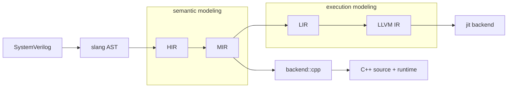

# Lyra: A Modern SystemVerilog Simulation Toolchain

[](https://github.com/hankhsu1996/lyra/actions/workflows/bazel-build.yml)
[](https://github.com/hankhsu1996/lyra/actions/workflows/cpp-style.yml)
[](https://github.com/hankhsu1996/lyra/actions/workflows/bazel-lint.yml)

**Lyra** is a SystemVerilog compiler and simulator that compiles each module, package, and interface
on its own and builds the design hierarchy when the simulation starts.

The usual approach is the opposite: flatten the whole design, specialize every instance, and hand
the result to a C++ compiler. That buys simulation speed and pays for it at every edit, because one
changed line has no boundary to stop at. Lyra bets that on a design under active development the
edit-run loop matters more than the last factor of simulation speed.

Those two commitments -- optimize the whole edit-run loop, compile per unit and elaborate at runtime
-- are what every other design decision answers to, and they are stated in
[docs/architecture/north_star.md](docs/architecture/north_star.md).

## What runs today

The RISC-V CPU under `examples/riscv-cpu/` -- packages, a module hierarchy, parameterized modules,
and `$readmemh` -- compiles and executes real programs:

```bash
bazel build //:lyra
cd examples/riscv-cpu
../../bazel-bin/lyra run --no-project --top all_tests *.sv tests/*.sv
```

```
Running all tests...

sum_test: PASS (x3 = 55)
fib_test: PASS (x3 = 55, fib(10))

Results: 2 passed, 0 failed
```

Coverage is measured, never assumed: every language feature is claimed by a case in `tests/cases/`,
and a case names the backends that run it. `docs/progress/` tracks what is not claimed yet, feature
by feature.

## Quick start

```bash
bazel build //:lyra

# Run a design end to end, streaming its output
./bazel-bin/lyra run --no-project --top Top examples/hello/hello.sv

# Report diagnostics without lowering anything
./bazel-bin/lyra check --no-project --top Top examples/hello/hello.sv

# Inspect any stage of the pipeline
./bazel-bin/lyra dump mir --no-project --top Top examples/hello/hello.sv

# Write a self-contained C++ project, and optionally build it
./bazel-bin/lyra emit cpp --no-project --top Top -o out examples/hello/hello.sv
./bazel-bin/lyra compile --no-project --top Top -o out examples/hello/hello.sv
```

`--no-project` names the sources on the command line. Reading them from a `lyra.toml` manifest is
not implemented yet, so every invocation needs it.

Everything after the command word is one command line shared with the slang driver, so slang's
front-end options reach Lyra unchanged. `lyra --help` prints the authoritative list.

## Two ways to execute

`run` takes `--backend`, and the two choices are different bets on where the design's code comes
from.

- **`cpp`** (default) emits C++ against the coroutine runtime in `include/lyra/runtime/` and builds
  it with the host compiler. Complete, and the reference every other backend is checked against.
- **`jit`** lowers to LLVM IR and executes it in-process, with no host C++ compiler involved. Faster
  to start and the direction of the project; still filling in language coverage.

Where both accept a source they must produce the same answer. A construct the execution backend has
not reached refuses to lower and says which one it was, so the difference between the backends is
always a diagnostic and never a different result.

By default a design is built for a fast edit-run loop. `--release` optimizes the simulation instead,
which is the right trade once the run is longer than the build.

## Architecture



- **AST**: parsed by [slang](https://github.com/MikePopoloski/slang).
- **HIR**: source-near semantic IR, preserving SystemVerilog constructs.
- **MIR**: object-oriented semantic IR -- objects, members, callables, actions. Semantic modeling
  ends here.
- **LIR**: execution-oriented IR -- control-flow graphs, basic blocks, storage.
- **backend::cpp**: a second MIR consumer, emitting C++ against the runtime.

The split down the middle is the one contract worth knowing before reading further: everything left
of LIR models what the design _means_, everything from LIR down models how it _runs_, and a fact
established on one side is never re-derived on the other.

See [docs/architecture/README.md](docs/architecture/README.md) for the layer contracts.

## Building

- [Bazel](https://bazel.build/), via [bazelisk](https://github.com/bazelbuild/bazelisk).
- A C++23 compiler. Lyra builds under both Clang and GCC.

```bash
bazel build //:lyra
bazel test //...
```

An emitted project carries its own `build.sh` and builds under a compiler other than the one that
produced it. It links a prebuilt runtime library, though, so that compiler has to be ABI-compatible
with the one that built Lyra -- in practice, the same standard library implementation.

## Examples and documentation

- [examples/](examples/) -- a minimal `$display` project and the RISC-V CPU above.
- [docs/](docs/) -- the documentation index.
