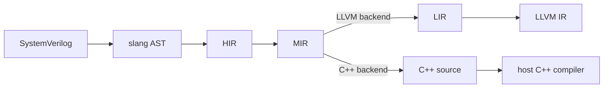

# Lyra: A Modern SystemVerilog Simulation Toolchain

[](https://github.com/hankhsu1996/lyra/actions/workflows/bazel-build.yml)
[](https://github.com/hankhsu1996/lyra/actions/workflows/cpp-style.yml)
[](https://github.com/hankhsu1996/lyra/actions/workflows/bazel-lint.yml)
[](LICENSE)

**Lyra** is a SystemVerilog compiler and simulator built the way a modern language toolchain is
built: around independently compilable units with explicit dependencies, where incremental and
parallel compilation are constraints on the design rather than optimizations added to it later.

The goal is a fast edit-run loop rather than peak simulation speed. Those two pull in different
directions, and Lyra picks the loop. A module, package, or interface compiles on its own into
class-level artifacts, and instantiation, parameter binding, and hierarchy all happen when the
simulation starts. Compile time then follows how many distinct units a design has, not how many
instances it elaborates into.

Those commitments, and the constraints that follow from them, are stated in
[docs/architecture/north_star.md](docs/architecture/north_star.md). Every other design document in
this repository answers to that one.

Coverage is measured rather than described. Every construct Lyra handles is claimed by a case under
`tests/conformance/` stating what IEEE 1800 requires of a program and checking itself against it,
and what each path cannot yet do is recorded once for that path, so what works is a fact about the
corpus and not a promise made here. `docs/progress/` carries the open frontier in SystemVerilog
terms.

## Getting started

You need [Bazel](https://bazel.build/), via [bazelisk](https://github.com/bazelbuild/bazelisk), and
a C++23 compiler. Lyra builds under both Clang and GCC.

```bash
bazel build //:lyra
./bazel-bin/lyra run --top Top examples/hello/hello.sv
```

Alongside `run` there is `check` for diagnostics alone, `dump` for reading any stage of the
pipeline, and `emit` and `compile` for producing a standalone C++ project. Everything after the
command word is one command line shared with the slang driver, so slang's front-end options reach
Lyra unchanged, and `lyra --help` is authoritative on all of it.

A design is named by its sources on the command line. Naming one by a manifest instead is not
implemented.

## Architecture



- **AST** is parsed by [slang](https://github.com/MikePopoloski/slang).
- **HIR** still spells SystemVerilog, but on memory and identity the compiler owns: dense ids from
  append-only containers, scoped so an edit in one unit shifts nothing in another. That ownership is
  what makes incremental and parallel compilation possible at all.
- **MIR** is object-oriented and language-neutral, and it is where meaning ends. Nothing below it
  re-derives a fact settled above it.
- **LIR** is execution-oriented, carrying control-flow graphs, basic blocks, and storage.

A design takes one of the two paths out of MIR, not both, and they are not equals. The LLVM path is
the product: it produces machine code itself, so it asks nothing of the machine it runs on. Once a
design is LLVM IR, executing it in process and compiling it ahead of time are two link-time choices
over that one backend rather than two pipelines, which is most of the reason the pipeline aims
there.

The C++ path is there to make MIR legible, because a person can read emitted C++ and judge whether a
design was modeled correctly in a way that reading LLVM IR does not allow. Its output is source, so
it needs a host compiler to finish.

## Contributing

Issues and pull requests are welcome. [CONTRIBUTING.md](CONTRIBUTING.md) covers the toolchain, the
formatting and style rules, and what a change owes the documentation. The short version is that
`bazel test //...` passes and formatters have run.

Worth knowing before proposing a design change: this repository argues with itself in writing.
`docs/architecture/` holds binding contracts, `docs/decisions/` records why each choice beat its
alternatives, and a change that contradicts one is expected to say so and make the case.

## Where to go next

- [docs/](docs/) for the architecture contracts and the design record behind them.
- [examples/](examples/) for designs you can run.

Lyra stands on [slang](https://github.com/MikePopoloski/slang) and [LLVM](https://llvm.org/), and
would be a much longer project without either. Licensed under the [MIT License](LICENSE).
