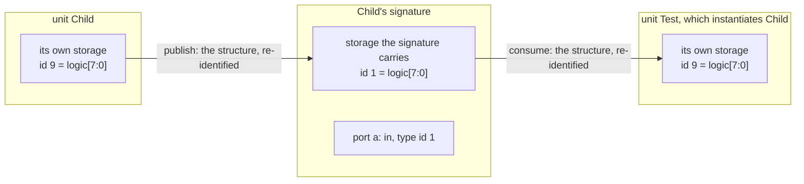

# Compilation Unit Model

## Purpose

Define what a compilation unit is, what it owns, and the rules that make it self-contained.

## Owns

- The identity of the compilation unit as the primary semantic boundary of the compiler.
- The enumeration of compilation-unit kinds: module, package, interface.
- The rule that a compilation unit compiles independently, given only its own contents and the
  signatures of the units it references.
- The signature a unit publishes across the compilation boundary: the declarations other units may
  name, produced by the unit from its own contents and consumed by other units by name. What a
  signature contains follows the unit's kind.
- The rule that a reference into another unit is either a name on that unit's signature or a name it
  never published, and that the two resolve at different times.
- The rule that a signature's content is fixed by what its consumers read, not by an enumerated
  list.
- The shape of instance records: minimal, structural, and free of semantic content that belongs
  inside the unit.

## Does Not Own

- The internal IR shape of any single layer (see `hir.md`, `mir.md`).
- The hierarchy and generate ownership model (see `hierarchy_and_generate.md`).
- Identity rules for declarations and references (see `identity_and_ownership.md`).

## Core Invariants

1. A compilation unit is the primary unit of compilation. Kinds include module, package, and
   interface. No other construct qualifies as a compilation unit.
2. A compilation unit's compile-time artifacts are class-level. They do not depend on any specific
   instance.
3. All semantic information needed to compile a unit is owned by the unit itself. Compilation never
   reaches outside the unit for semantic data.
4. Cross-unit access is only through explicit import or external reference mechanisms. Implicit
   cross-unit access is not allowed.
5. Parameters on a compilation unit are constructor or config inputs. They do not introduce
   per-instance compile-time identity.
6. Instance records carry only per-instance data: wiring, hierarchical position, parameter values,
   and runtime object identity.
7. The fully elaborated instance graph is not the compile-time model. The frontend may produce a
   full elaboration, but the compiler operates on compilation units and specializations. Instance
   expansion does not drive compilation, and compile-time identity does not depend on instance
   enumeration.
8. A unit's only cross-boundary surface is its signature: the set of declarations it publishes,
   whose content follows the unit's kind -- a module publishes its ports, a package its
   declarations, an interface its ports and its members. The unit produces its signature from its
   own contents, so nothing it publishes can contradict what it is. A unit that instantiates or
   references another depends only on that signature, identified by name, never on the other unit's
   body or internal ids. Units compile independently and in any order and are combined by matching
   names; they share no identifier space and exchange no internal state.
9. A signature names each class it publishes, and names which of them a referrer instantiates. A
   unit's name, the name of a class it declares, and where a backend places the emitted code are
   three separate facts; none substitutes for another, and a published class is never identified by
   name equality with its unit or by its position in a list.
10. A reference into another unit takes one of exactly two forms, decided by whether the target
    published the name. A name on the signature resolves against that signature where the referrer
    compiles, and reaches the target's own access protocol. A name the target never published has no
    signature to compile against and resolves by name during elaboration. There is no third form,
    and no consumer chooses between them by inspecting the target.
11. A unit's emission is a function of its own contents and the signatures it consumes, and of
    nothing else. This is what makes a signature's content decidable: a fact absent from every
    signature cannot have reached a referrer, so it cannot invalidate one. A lowering that reaches a
    fact about another unit by any other path breaks that property, and the break is invisible until
    compiled units are reused, at which point it is a stale result rather than an error.
12. A signature carries the storage its own identities index. It is read where the publishing unit's
    storage is not, so an identity written on one addresses storage the signature itself holds,
    never the publishing unit's. A consumer takes the structure into its own storage and answers
    with its own identity for it, so what crosses the boundary is structure and nothing else. This
    is invariant 8's "never on the other unit's internal ids" applied to a fact too compound to be a
    name -- a type, whose value is a graph.

## Boundary to Adjacent Layers

- The compiler defines the compilation unit model. The frontend provides source material and
  elaboration hints; it does not define what a compilation unit is or which compilation units exist.
- The runtime constructor consumes compile-time artifacts and per-instance records to build the
  object graph.
- `reference_resolution.md` defines how the cross-unit access named here is resolved: at
  construction, once, into a stored direct reference.
- `incremental_build.md` owns when a signature is derived relative to the bodies that consume it,
  and the parallelism that ordering permits. This doc owns what a signature contains and who may
  name it; that doc owns the order the units' work runs in.

## Forbidden Shapes

- Per-instance semantic tables consulted at compile time (variable lists, resolver maps keyed on
  instance identity).
- A compilation unit reaching through a global or design-level lookup to answer a question about its
  own declarations.
- Instance records that carry a copy of the unit's semantic state.
- Maps keyed by `(instance_id, local_symbol)` used to resolve a reference inside the unit.
- Implicit cross-unit access that bypasses explicit import or external reference.
- A design-wide index, ordinal, or numbering that two units both depend on to refer to each other. A
  cross-unit reference is a name resolved against a signature, never a shared position in a global
  table.
- Compiling one unit against another unit's body or internal ids instead of against its signature.
- A signature defined as one fixed set of declaration kinds for every unit kind, or authored beside
  a unit rather than derived from it.
- A field admitted to a signature because a reader thought of it rather than because a lowering
  reads it about another unit, and a lowering that reads such a fact through any path other than the
  signature. The two are the same defect from opposite ends.
- A run-time by-name lookup standing in for a name the target unit published. The signature is what
  a referrer compiles against; resolving a published name at run time discards the check the
  signature exists to give, and pays for an independence the declared dependency has already spent.
- A unit that knows or enumerates the units that reference it: a consumer/referrer list, a back-edge
  from a member to the references that read it, or code that resolves a reference on a referrer's
  behalf by pushing its own member outward. A unit produces only its own signature from its own
  contents; who depends on that signature is not part of the unit and is never visible to it.
  Resolution is always pulled by the referrer, never pushed by the target.
- Treating "the design" as a compilation unit.
- Treating the frontend as the authority for compilation-unit identity, membership, or boundary. The
  frontend is input; the compiler is authority.
- Treating the elaborated instance graph as the compilation model, or allowing instance count to
  drive the number of compilation artifacts.
- Per-instance compilation: forking a compile-time artifact per instance rather than per
  specialization.

## Notes / Examples

If resolving a name inside a compilation unit requires information not reachable from the unit
itself, the compilation-unit boundary has been violated. The fix is to move ownership inward, not to
add another lookup path outward.

### What crossing the boundary looks like

A compound fact -- a type, a class -- is not a name a consumer can simply read. It is a graph, held
in storage the publishing unit owns, addressed by identities that mean nothing anywhere else. So
three separate holdings exist for one such fact, and no two of them share an identity:

One type, three identities, and each is only meaningful in the holding that minted it. `Test` cannot
carry `Child`'s number and cannot carry the signature's; it takes the structure and answers with its
own. What travels is never an identity.

Two properties are what pay for this, and they are the two the north star asks for. One holding for
the whole design would remove the transfer, and with it both: a single holding has a single writer,
so no two units are lowered at once; and its numbering would depend on every unit in the design, so
a change anywhere would invalidate every unit compiled against it.

The transfer must also land on what the consumer already has. `Test` declaring its own `logic [7:0]`
and receiving `Child`'s must reach one identity, not two -- so the consumer's storage decides
identity by structure. Without that, which identity a construct carries would depend on the route it
arrived by, which is a difference between two things that are the same type.

**A module header is the source-level shape of a signature, and not the same set.** LRM 23.2.1 says
a module header defines the module's name, its port list, each port's direction and size, the type
of data passed through each port, the module's parameter constants, its package import list, and the
default lifetime of subroutines defined within it. Two of those face inward -- the import list
decides how names resolve inside the body, and the default lifetime governs subroutines defined
within the module -- and the parameter constants are consumed by specialization, since distinct
bindings are distinct specializations with distinct identities. What remains is the name and, per
port, its direction, size, and data type. The header is the right way to explain a signature to a
SystemVerilog reader; it is not a definition of one.

The term "compilation unit" here is the compiler's own: a module, package, or interface. It is not
the LRM's "compilation unit" (LRM 3.12.1), which names the `$unit` file-set scope that holds
declarations lying outside any design element. The two concepts are unrelated; do not conflate them
when packages or `$unit`-scope declarations enter scope.
