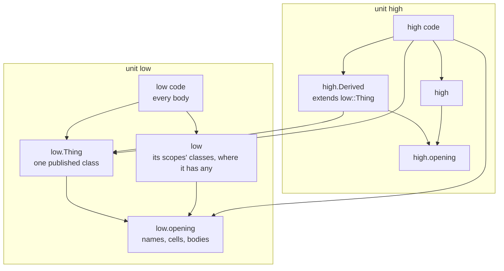

# Emission Model

## Purpose

Define how a backend turns per-unit MIR into runnable artifacts while preserving the independent,
parallel compilation that `north_star.md` requires. This doc owns the **emit-side realization** of
the compilation-unit boundary and of cross-unit reference resolution: what one unit's emitted
artifact may depend on, how cross-unit access is expressed without breaking unit independence, and
what role the runtime SDK plays as the link-time-resolution substrate. It is the missing layer
between the principle in `reference_resolution.md` (a cross-unit reference is checked against what
the target published where the referrer compiles, and executes once at construction) and the backend
code that must obey it.

Both backends exist; the LLVM one is where the design is heading. The rules here are stated for any
backend. Where a backend takes a transitional shortcut, that is noted as non-conforming code, not as
a relaxation of the contract.

The artifact rules below are met. Each unit specialization is emitted as the declarations a referrer
compiles against and the translation unit realizing them, and the program is formed by compiling
each translation unit and linking the results, so no unit's bodies are read while another is
compiled. A build may compile several at once, and how many is stated by whoever invoked it rather
than chosen by the build. What the boundary still does not buy is recompiling less than everything:
nothing records which artifact a change invalidated, so every build compiles every unit, however
many of them it works on at a time.

## Owns

- The rule that a backend emits, per compilation-unit specialization, a signature artifact and a
  code artifact, and that the program is assembled by linking those artifacts -- never by a single
  artifact that aggregates many units.
- The set of inputs one unit's emission may depend on: its own MIR, the signatures of the units it
  references, and the runtime SDK.
- The contract that a reference into another unit is a typed access against the class that unit
  published, resolved where the referrer compiles and executed once at construction, and that the
  referrer's emitted artifact never embeds what lies outside that published class -- what lowering
  adds to the unit's realization, or the object's size -- and never names a unit it does not
  reference.
- The rule that what a change re-emits follows the signatures a referrer consumes, not the files it
  reads.
- The role of the runtime SDK as the substrate that stands in for link-time symbol resolution and
  (under LLVM) intrinsics.

## Does Not Own

- Where the runtime library lives and how a binary locates it, and the foreign-language ABI surface
  an emitted project publishes to a user's own sources (see `runtime_distribution.md`). Each unit
  states its own part of that surface and the build assembles the union, so it is no exception to
  the per-unit rule below; what the name space is and who checks it lives there.
- The compilation-unit boundary itself and what a unit's signature is (see
  `compilation_unit_model.md`).
- When and into what a cross-unit reference resolves, semantically (see `reference_resolution.md`);
  this doc owns only how a backend _realizes_ that resolution.
- The object-graph shape the resolution navigates (see `hierarchy_and_generate.md`).
- IR-layer shapes (see `mir.md`, `lir.md`).

## Core Invariants

1. **A signature and a code artifact per unit specialization; the program is linked, not
   aggregated.** A backend emits each unit specialization as a signature and a code artifact. The
   signature is derived from the unit's declarations alone, so it completes without lowering a
   single body; the code carries the bodies. No emitted artifact contains the bodies of more than
   one unit, and none enumerates "all units." The program is formed by linking the per-unit
   artifacts. This is what keeps compilation parallel and incremental (`north_star.md` inv 3, 4),
   and the split is what makes it pipelined: a unit's referrers compile against its signature while
   its own code is still being emitted.

   **A signature is one artifact and may be more than one file.** Where the target reads
   declarations in an order and reads each file once, the files have to be no coarser than what the
   order is actually over -- otherwise a design whose declarations can be ordered has files that
   cannot, and a correct program is refused for the shape of its artifacts, which `north_star.md`
   inv 3 forbids. Which file a declaration is written in is the backend's own business and no
   consumer of the signature reads it.

2. **A unit's emission depends only on itself, the signatures of the units it references, and the
   SDK.** The inputs to emitting unit U are: U's own MIR; the signature of each unit U references;
   and the runtime SDK. U references a unit it instantiates, one it holds a handle to an instance
   of, one it calls a receiver-less callable of (LRM 26.3), and one it reads or writes a static
   variable of by name (LRM 26.2). U's artifact never depends on a unit it does not reference, on
   another unit's code, or on a declaration that unit did not publish (`compilation_unit_model.md`
   inv 8). Because those are the only inputs, a fact absent from every signature cannot have reached
   U, so it cannot invalidate U (`compilation_unit_model.md` inv 11).
3. **The runtime SDK is the link-time-resolution substrate.** Cross-unit operations the referrer
   cannot resolve from its own inputs are expressed as SDK operations. In the C++ backend the SDK is
   the runtime library; under LLVM its operations become intrinsics the linker resolves. A backend
   never invents a second cross-unit mechanism outside the SDK.
4. **A route that descends or crosses an instance resolves once and seals into a sealed endpoint.**
   Such a route executes in Resolve and produces a candidate endpoint that the sealing barrier
   commits as the reference's final access point; a route of parent edges within the instance has
   nothing to resolve and is walked where it is used. Either way the simulation-time read and change
   observation perform no per-access lookup (`reference_resolution.md` inv 3, 5).
5. **Every step of a route is a typed access.** A route is an anchor, steps and a leaf, and each is
   compiled against a declaration the referrer has: a class the emitting artifact owns, or a class
   another unit published. Realization is typed navigation -- through a stable MIR member identity
   when the artifact owns both classes, and through the member's name resolved against the published
   class at the referrer's compile time when it does not. The emitted code reaches the next pointer
   or member via a typed access expression, steps into a generate block through the construct's
   published entry viewed as the block's published class, and calls a published subroutine directly.
   No step carries a string and none is an SDK lookup by name; the one SDK call a route may make is
   the anchor of an upward name, which asks for the nearest enclosing scope of a class and downcasts
   statically to it. The sealed endpoint is one access point however many steps the route contained.

6. **A scope is two classes: the published part and the realization extending it.** The published
   part holds the published members first, in the order the publication states, and one non-virtual
   method per subroutine that forwards to its body; the realization adds what lowering adds -- a
   slot per route, process state, the homes of closures. A referrer compiles against the published
   part alone, reads a member at its offset there and calls a subroutine directly, and never needs
   the object's size, because the element's own entry makes every object of it. Nothing about a
   scope is answered by name at run time: a scope keeps its hierarchy segment for `%m` and a scope
   class keeps its DPI-C export table, and neither is a lookup a route reaches.
7. **A change re-emits exactly the referrers whose consumed signature changed.** A change confined
   to a unit's bodies changes only its realization, so it changes no signature and re-emits no
   referrer. A change to a declaration changes what the unit publishes and re-emits every unit that
   consumes it, which is the dependency being real rather than the mechanism being coarse.

   **A referrer consumes a part of a signature, not the unit whole.** What a unit publishes is its
   namespace and each class it published, and a reference reads one of those; recording which one is
   what keeps a change to a class nobody read from reaching anybody. Recording the unit instead
   would make every referrer of a package depend on every class in it, which is the mechanism being
   coarse rather than the dependency being real.

8. **A published member is placed by the publication, and nothing lowering adds can move it.**
   Because the published part leads the object (invariant 6) and everything the realization adds
   sits after it, a referrer and the declaring unit compute one offset from the same declarations. A
   body edit therefore moves no published member, and a referrer's access to one costs what an
   access to its own member costs, with nothing dispatched.

   **A published class is named from declarations alone, and how many classes realize it is no
   referrer's concern.** A generate block is a definition nested in the scope holding it, and each
   block instance is an application of it; an application is one published class, named before any
   body lowers. Block instances of one application whose bodies lower apart are that class realized
   more than once, each realization extending it. A referrer names the published class and is
   unaffected by how many realizations stand beneath it, so a body edit that changes the count
   changes nothing a referrer read.

9. **The design's own link-level unit is a unit, and invariant 2 binds it.** A design needs one
   artifact nothing in the source declares -- the one whose construct elaborates the design by
   building the tops. It is synthesized rather than lowered from a source module, and that changes
   nothing about what it may read: the signatures of the units it references, and no unit's
   contents. Work that cannot be expressed that way is not this unit's, and the party it belongs to
   is whoever runs after compilation. Symbol uniqueness across units is the linker's, by the same
   mechanism any target uses for a definition several artifacts emit. Composing what each unit
   registers -- an initialization order, the union of a foreign name space -- is the runtime's or
   the build's. A compiler that does either itself has to read every unit, which is the one thing a
   unit boundary exists to forbid.

10. **A backend is a choice of linker, not a choice of pipeline.** What an artifact is varies -- an
    object file, a target-language source compiled separately, a module loaded into an execution
    session -- and so does the party that resolves names across artifacts. Nothing upstream of the
    artifact varies with that choice. An execution session is a linker: it resolves symbols across
    modules as it loads them, which is the same job a system linker does earlier. So a backend that
    needs a different pipeline shape from another backend has put something in the wrong place, and
    the thing in the wrong place is upstream of both.

## Boundary to Adjacent Layers

- `compilation_unit_model.md` defines the unit and its signature; this doc defines what a unit's
  _emitted artifact_ may depend on, which is exactly those signatures plus the SDK.
- `reference_resolution.md` defines a route's steps and the sealing contract; this doc defines how a
  backend realizes each step without breaking unit independence.
- `backend_contract.md` defines the per-node within-an-artifact realization rules: how a MIR node
  becomes target-language source. This doc draws the artifact boundary; `backend_contract.md`
  governs what happens inside.
- `runtime_distribution.md` owns where the SDK/runtime lives; this doc owns the SDK's role as the
  link-time-resolution substrate.
- `runtime_model.md` places route execution in the constructor context and the read in the
  simulation context.

## Forbidden Shapes

- An emitted artifact that contains more than one unit's bodies, or that enumerates all units (a
  global "wiring" file). This is the canonical violation: it serializes otherwise-independent
  compilation and reintroduces an undeclared whole-design dependency.
- A synthesized link-level unit that reads the units' contents rather than their signatures. Being
  synthesized rather than lowered from source is not a licence: it is a referrer like any other, and
  a step that needs two units' contents at once is a link step or a runtime step wearing a
  compiler's clothes.
- A referrer's artifact that names, includes, or casts to the type of a unit it does not reference,
  or names what a referenced unit's realization adds beyond its published class. Naming a referenced
  unit's own published declaration is not this shape: that declaration is what the referrer compiles
  against, and reaching it by name is what a declared dependency is for.
- A referrer's artifact that depends on another unit's object size or on any offset past its
  published members. Those move with the unit's bodies, so depending on them would make a body edit
  recompile every referrer.
- A run-time by-name lookup emitted for any hierarchical name: a scope registering its declarations
  under their names, a child searched for by name, a name table on a scope or a class, or a string
  carried by a route. It replaces a compile-time check with an unchecked cast, surfaces a misspelt
  name or a type that differs between instances at run time, and makes every instance pay a
  registration per declaration. The access is typed against the published class instead.
- A virtual method on a scope's published part, or a referrer dispatching through one, to reach a
  published subroutine or member. The language dispatches no such call, and a referrer that knows
  the published class has nothing to dispatch on. A published subroutine's own method asking which
  of its unit's classes realizes the object is not this shape: the referrer still calls one method
  directly, and the question is one only the declaring unit can ask.
- A published class whose name, or whose existence, depends on a comparison of lowered bodies. Which
  class a name reaches would then move with a body edit, and every referrer with it.
- A signature artifact that also carries the unit's bodies, so that editing a body re-emits the
  unit's referrers. The file boundary is not the dependency boundary.
- A route mechanism dispatched on the frontend's lexical-form classification or on source order.
  Every step is the same typed step whatever form named the target.
- A reference shape that splits cross-unit and intra-unit references into separate IR species,
  separate install paths, separate vocabulary items. One reference, one route.
- A design-global signal or path table that mirrors the object graph. Routes navigate the object
  graph locally -- the parent chain, an owned child, a generate entry -- through typed steps.
- A per-access cross-instance lookup on the simulation path; the hot path reads a sealed endpoint.
- A second cross-instance access mechanism that bypasses the route and its sealed endpoint.
- An IR vocabulary item modeling a particular SDK resolver shape (a named-method family carrying
  bind state, a wrapper-typed member kind). The IR vocabulary names only steps, route, and endpoint.
- A binding installed in the constructor block. Routes execute in Resolve and seal in Seal; ctor
  allocates the shell only.

## Notes / Examples

### What a unit emits, and what reads what

Two packages, where `high` declares a class extending one of `low`'s and a subroutine calling one of
`low`'s. Every arrow is "reads first"; every box is one emitted file.

Three things the picture is for, none of which a sentence carries as well.

**No arrow crosses into a unit's code file.** That is invariant 1: a referrer reads declarations and
never bodies, so `low`'s bodies can still be changing while `high` compiles.

**The arrows between units land on a part, never on a unit.** `high.Derived` reads `low.Thing`
because that is the class it extends, and `high`'s code reads `low.opening` because that is where
the subroutine it calls is declared. Neither reads a file holding the rest of `low`, so a second
class of `low` that `high` never named is text `high` never sees.

**A code file names every part its unit read, including the ones its own declarations already
brought.** `high`'s code reads `low.Thing` although `high.Derived` did too. The repetition is the
point: what a unit depends on is stated in one place a reader can open, rather than being whatever
the declarations happened to pull in behind them.

**The graph cannot close.** A declaration draws an arrow to another unit in two ways. A class draws
one to the class it rests on (invariant 1's second paragraph), so those edges have the shape of the
class-extends graph -- which no program can make circular, since a class may not be its own
ancestor. A unit's declarations that name another design element's published classes draw an arrow
to what declares those classes without defining them, and that reads nothing, so it ends every path
it is on. Two units whose names reach each other -- one calling the other's task while the other
names the first upward -- therefore read each other's declarations without a cycle. The file holding
a unit's scope classes is read by code files alone, so it starts arrows and never receives one from
another unit's declarations.

_Current implementation, C++ backend:_ each unit writes a `<Unit>.forward.hpp` holding every class
other units may name that C++ can declare ahead of its definition, and a unit's opening header
includes the forward headers of the units whose classes it names. A design element's scope classes
are nested classes written together in `<Unit>.hpp`, the class of a generate block declared inside
the class of the scope holding it; a class the source declared has a file of its own, since another
unit's class may extend it. A nested class cannot be declared ahead of its definition, so text
naming another unit's block class reads that unit's `<Unit>.hpp`; only a code file does, because a
scope's class holds what it reaches in another unit as the class every scope extends.

**Same-unit sibling reference.** `always_comb from_b = b.bx;` inside generate block `a` of `Top`.
The route has two steps: `a -> Top` (typed; the parent edge whose target class lives in Top's
artifact) and `Top -> b -> bx` (typed; sibling member access plus variable access, both in Top's
artifact). Top's emission produces a typed pointer chain; no SDK call. Resolve produces the
candidate endpoint; Seal commits the variable's cell.

**Cross-unit downward reference.** `always_comb r = c.p;` where `p` is one of `c`'s ports, and
`always_comb r = c.x;` where `x` is one of its internal variables. Both routes open with the same
step `parent -> c`, since the parent's artifact owns the `c` member's pointer type, and both end at
a member of `c`'s published class, so the parent emits a typed access at that member's offset in the
published part and a renamed `p` or `x` fails where the parent compiles. A call `c.tick()` is a
direct call to the published part's forwarding method for `tick`.

**What each backend borrows to realize a cross-unit step.** A referrer needs the published part's
layout and the symbol of each forwarding method. A backend emitting to a language with its own name
resolution borrows both from that language's compiler, which is why including a declaration-only
header is sufficient there. A backend emitting machine code computes the same offsets from the same
publication and calls the same symbols. Neither reaches past the published members, which is what
invariant 8 states.

**Cross-unit upward reference.** `always_comb x = Top.g;`. The referrer does not instantiate `Top`.
The front end's search lands on `Top`'s class; the route's anchor asks the runtime for the nearest
enclosing scope of that class and downcasts statically to it, and `g` is a member of `Top`'s
published class. The referrer's artifact carries no knowledge of Top's body; the route arrives as
ordinary MIR primitives in the emitted resolve code, not as type payload -- `backend_contract.md`
keeps render mechanical.

**A route through generate blocks.** `top.gen[2].child.x` from outside `top`: `top -> gen[2]` reads
the loop construct's published entry at the block's position and views it as the block's published
class, `gen[2] -> child` is the published member holding the child, and `child -> x` is a member of
`child`'s published class. Every step is typed; the sealed endpoint is one access point.

**Cross-unit package call.** `r = pkg::add_base(23);`, where `pkg` is a package the caller neither
instantiates nor owns. Unlike the references above, this reaches no object and no per-instance cell:
a package has no instance layout, only namespace-level declarations, so its callable is an ordinary
link-time symbol. The caller's artifact renders the direct qualified call and includes the package's
own emitted header; the linker binds the symbol. There is no route and no runtime object-graph
traversal, because a package has no instance identity to reach; a call to a module's published
subroutine differs only in that a route first reaches the object it runs on.

**Cross-unit package variable.** `x = pkg::cnt;` or `pkg::cnt = 7;` (LRM 26.2) is the storage
counterpart of the call. A package variable is one program-global cell, not a per-instance member,
so it too is an ordinary link-time symbol: the caller renders the direct qualified access and
includes the package's header, and the linker binds the one definition. Reading, writing, and waking
on the cell's change all reach that same linked cell directly -- there is no route, no per-instance
endpoint to seal, and no SDK step, again because a package has no instance identity. Its LRM 10.5
initialization is not a per-instance constructor action but two receiver-less callables the design
root invokes during the Initialize phase, before the top modules initialize: one installs every
package's cells (declared type and default) design-wide, then one runs each package's value
initializers -- so a value initializer that reads another package's cell always reaches installed
storage. The LRM leaves the relative order of initializers unspecified, and no party computes one:
the root calls every package in a stable order, each initializer takes its package's one bring-up
before descending, and a package whose own initializers read another calls that one first. The order
is therefore those calls executed, which makes a cyclic dependency terminate on a default rather
than fail and leaves nothing reading across units to decide it.

Any artifact that aggregates multiple units' bodies into one is forbidden, however a build step
packages the emitted sources: the per-unit artifact boundary and the typed-step rules above are the
contract every backend must satisfy.
