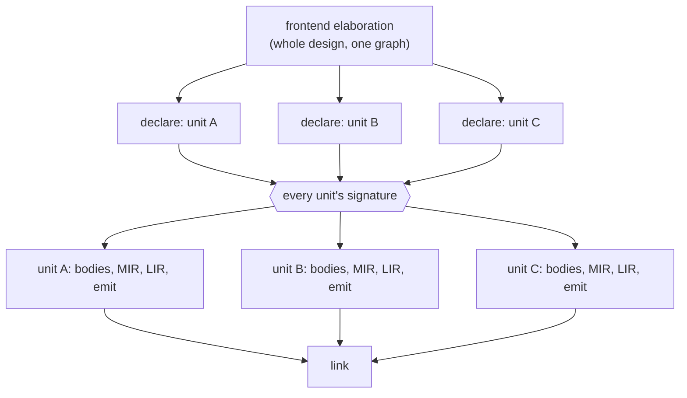

# Incremental Build

## Purpose

Define how incremental compilation works at the architectural level: what is cached, how identity is
defined across sessions, how reuse is determined, and what shape the work takes so that units
compile in parallel.

This is a contract the compiler does not yet realize: today a change recompiles everything. The
rules here constrain every layer regardless, because they are what keeps a later query-based
implementation possible -- a design that assumes whole-design recompilation forecloses it.

## Owns

- The query model: compilation expressed as a graph of memoized queries.
- The definition of stable keys that identify what each query computes.
- The definition of fingerprints that detect semantic change.
- The granularity at which incremental reuse is tracked.
- The rule that invalidation is bounded by ownership.
- The staging that makes units independent of each other: every unit's signature is derived before
  any unit's bodies are lowered, and a unit's later work consumes only signatures.
- The rule that the only cross-unit synchronization points are that staging barrier and the final
  link.

## Does Not Own

- Specific query implementations or on-disk storage formats.
- Build-tool integration (how the scheduler dispatches queries, what executable drives them).
- Runtime behavior or simulation outcomes.
- The shape of compilation units or IR layers (covered by other architecture docs).
- What a signature contains (see `compilation_unit_model.md`).

## Core Invariants

1. **Incremental compilation is query-based.** Compilation is expressed as a directed acyclic graph
   of queries. Every query depends only on its explicitly declared inputs; implicit data flow is
   forbidden. Query results are memoized under their stable keys.
2. **Stable keys are ownership-based.** A query key is derived from ownership (compilation unit,
   callable, type, etc.). Keys do not depend on traversal order or insertion position.
3. **Fingerprints capture semantic meaning, not syntax spelling.** A fingerprint excludes
   non-semantic details such as identifier names, source spans, and source positions. Renaming a
   variable does not change the fingerprint if the semantics are unchanged.
4. **Identity has two roles: matching and semantic equivalence.** A key answers "what is being
   computed" and matches a current entity to its previous self. A fingerprint answers "has the
   meaning changed" and decides whether the cached result can be reused. The two are distinct values
   and must not collapse into one.
5. **Incremental reuse is bounded by ownership.** A change affects only the owning scope and its
   transitive dependents declared in the query graph. Unrelated callables and compilation units are
   not invalidated.
6. **No global identity coupling.** No design-global id space participates in incremental keys or
   fingerprints.
7. **Tracked granularity is coarse, not per-expression.** Reuse is tracked at, at minimum,
   compilation-unit, specialization, and callable or process level. Expression-level incrementality
   is not required.
8. **Deriving a unit's signature reads nothing outside that unit.** A signature is a function of its
   own unit's declarations. Nothing about another unit is required to produce one, so every unit's
   signature is computable at once, in any order, with no dependency graph among them and therefore
   no cycle to detect. _This is the property the rest of the staging rests on; if it ever fails, the
   whole design collapses back into ordered compilation._
9. **Signatures for the whole design are derived before any unit's bodies are lowered.** That
   ordering is the only cross-unit synchronization the pipeline has before the link. It exists
   because the design admits mutual reference between units, exactly as a compilation unit admits it
   between its own declarations: a body cannot reference what has not been declared, whatever scope
   "declared" is measured in.
10. **After that point a unit's remaining work names no other unit's work.** Each stage's inputs are
    the unit's own prior stage plus the signatures of the units it references, so the stages of
    different units interleave freely: one unit may be emitting while another is still lowering
    bodies. A stage that needs no signature receives an empty set, which is the same shape as
    receiving many.
11. **Consuming a signature is what records a dependency.** A unit's dependency on another is
    exactly the set of signatures it consumed, so the query graph's cross-unit edges are enumerable
    rather than discovered. A fact reaching a unit by any other path is a dependency the graph does
    not have, and it is invisible until a cached result is reused, at which point it is a stale
    result rather than an error.

## Boundary to Adjacent Layers

- `identity_and_ownership.md` establishes that identity follows ownership, not traversal order. This
  doc builds on that rule as the foundation of stable keys; it does not restate it.
- `compilation_unit_model.md` defines the compilation-unit ownership boundary and what a unit's
  signature contains. This doc uses that boundary as the coarsest granularity of incremental reuse,
  and the signature as the unit of cross-unit dependency; it does not define what is on one.
- `specialization_model.md` defines specialization keys. Specialization keys feed the cache this doc
  describes; this doc does not redefine them.
- `lowering_boundaries.md` owns what a single lowering may do. This doc owns the order the units'
  lowerings run in relative to each other, which is a separate axis.
- Each IR layer defines its own identity kinds. This doc uses those identities as key sources; it
  does not redefine them.

## Forbidden Shapes

- Using raw pointer identity as part of a key.
- Using global sequential ids as stable keys.
- Fingerprints derived from raw source text rather than from semantic content.
- Dependencies between queries that are not captured in the query graph.
- Recomputing entire compilation units in response to a local edit inside one callable.
- A key scheme that shifts when unrelated entities are inserted, removed, or reordered.
- Collapsing the key and the fingerprint into a single value, such that semantic equivalence cannot
  be detected independently of structural identity.
- Signature derivation that consults another unit. It would put a dependency graph, an order, and a
  cycle diagnostic in front of the one stage that has none of those, and every later stage would
  inherit the ordering.
- A compilation order computed over the units. After the signature stage there is nothing to order:
  a scheduler that sequences units is serializing work that has no edge between it.
- A stage that reaches a fact about another unit around its signature -- through a whole-design
  view, a global table, or a shared frontend graph. The fact is then outside the query graph, so no
  fingerprint covers it.
- A synchronization point between the signature stage and the link. Any barrier there stalls units
  that have no dependency on each other.

## Notes / Examples

### The shape of the work

One sequential head, one barrier, one join. Between the barrier and the join every unit is a
pipeline of its own with no edge to any other, which is why a unit may reach emit while its
neighbour is still lowering bodies.

The barrier is not a cost being tolerated. It is what removes every other ordering: because no
signature needs another, the stage before it is unordered, and because every signature exists after
it, the stages following it are unordered too.

### Why the barrier sits where it does

A body may reference a declaration; a declaration never references a body. That asymmetry is what
puts all declarations before all bodies, and it holds at whatever scope mutual reference is admitted
in. Within one compilation unit it puts that unit's declarations before that unit's bodies. Across
the design -- where one unit's body reaches into another unit -- it puts every unit's declarations
before every unit's bodies. The same asymmetry, read at two scopes.

### Rename example

A variable is renamed inside one callable of one compilation unit:

- The callable's key is unchanged, because ownership is unchanged.
- The callable's fingerprint is unchanged, because the semantics are unchanged; only the name
  differs.
- The cached result for that callable is reused.
- Every other callable in the unit and every other compilation unit are unaffected.

If the rename caused cascading recomputation, the key or fingerprint scheme depends on non-semantic
details and violates this contract.

### What a change reaches

| The change                       | What re-runs                                                               |
| -------------------------------- | -------------------------------------------------------------------------- |
| A body of unit U                 | U's stages after the barrier                                               |
| A declaration U publishes        | U's stages, and the post-barrier stages of every consumer of U's signature |
| A declaration U does not publish | U's stages only; no consumer names it, so none depends on it               |

The third row is what the signature buys, and it is the common edit. A unit's internals change far
more often than what it promises.
