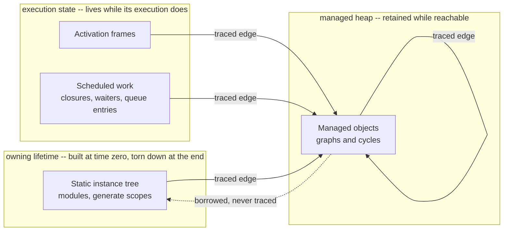

# Lifetime

## Purpose

Every piece of state this compiler produces belongs to exactly one lifetime regime, and this
document says which regimes exist, why each is the way it is, and what each is analogous to.
SystemVerilog needs more than one because the language is two languages: an object half whose
reference model the standard says is Java's, and a value half that is C++'s and Ada's. Neither
half's answer works for the other, so borrowing one for the other is the recurring design error this
document exists to prevent.

## The regimes, and why there are three

| Regime         | Holds                           | Ends when                     | Who ends it                         | Its analogue                        |
| -------------- | ------------------------------- | ----------------------------- | ----------------------------------- | ----------------------------------- |
| **Automatic**  | a body's own locals             | the declaring scope ends      | the compiler, by emitting the end   | a C++ or Ada local                  |
| **Managed**    | class objects reached by handle | nothing can reach it any more | a tracing collector, at a safepoint | a Java or C# object                 |
| **Structural** | a module or scope's members     | the design is torn down       | construction's own inverse          | a C++ member of a long-lived object |

The first two are the language's two halves and the split is forced, not chosen:

- **A value has no identity.** `b = a` on a value makes an independent copy, so "is anything still
  referring to it" is not a question that can be asked. A collector answers exactly that question,
  so it has nothing to decide about a value.
- **An object is nothing but identity.** `b = a` on a handle makes both names mean one object, so
  its end cannot be tied to any one scope. Scope-based ending has nothing to decide about it.

So the two mechanisms are not alternatives that a tidier design would collapse; each is the only
answer to its own half. What a design can get wrong is applying one to the other -- reaching for a
collector for values, or for a scope for objects -- and both mistakes read as simplifications.

## Ending a value is the compiler's to emit, and the program never spells it

SystemVerilog has no destructor, and it is tempting to read that as "nothing ends". C++ users do not
write `~vector()` either; the compiler emits it, at every exit from the scope, including the ones
the source does not mention. **A language having no destructor syntax says what a program may spell,
not what an implementation must do.**

Java is the case where both are true at once, and the reason is worth keeping: its primitives are
flat, so there is nothing to end, and everything else is collected. That is why the absence is real
there and only apparent here.

"Every exit" includes the one no statement of the body spells and no reader thinks of first: an
execution that is parked and never resumed, because whoever drives it ended it instead. That is an
exit from every scope the body has open, so it owes the same endings, and a backend that reaches its
scope exits only through statements will silently leak exactly there. It is the same path a
coroutine's destroy takes in C++, where the language emits it and nobody has to notice.

Which leaves the question that decides how much of this a value costs: **does the value's
representation own anything?** A flat run of bits owns nothing and ends by the scope's storage going
away, with nothing emitted. A run-time-sized container owns storage and must be ended. So the
automatic regime's real work is confined to the values of the second kind, and a representation that
gives the first kind something to own is paying that work for nothing
(`../decisions/jit-value-realization.md` states the current realization and what it defers).

## A regime is a property of the state, never of the code around it

The automatic regime says a value ends when its declaring scope does. That is a fact about the
declaration, and it stays the same fact however the body is written. Two things follow, and the
second is the one that is easy to lose.

**Where the storage physically sits is not part of the regime.** A local of a body that can suspend
has to survive the suspension, so it is placed wherever survival requires -- and that is the same
automatic object, placed by ordinary lowering. A language with coroutines does not gain a second
kind of local; the transform promotes the ones that must survive. A model that names them
differently has recorded a lowering result as a semantic distinction.

**Where the storage is reclaimed from is not part of the regime either.** A region whose lifetime
happens to cover a value is a way of freeing it, not a statement of how long it lives. The moment a
value's end is read off which region it was allocated from, the region's shape -- and therefore the
shape of the control flow that opened it -- has become the answer to a question about the
declaration. The tell is that two variables with identical declarations get different treatment
because of something about the bodies they sit in.

Neither observation forbids regions. A region is a legitimate way to allocate, and pooling the
short-lived temporaries of one call is an ordinary optimization. What it may not be is the place a
value's lifetime is _stated_.

## The managed regime

The rest of this document fixes the managed regime and the storage discipline that makes precise
reclamation possible. A SystemVerilog class object is a dynamically allocated, language-managed
object: created by `new` at arbitrary simulation time, never explicitly freed, with no user-visible
destructor, freely copyable by handle, identity-comparable, and free to form arbitrary object graphs
including cycles. The simulator -- not the SystemVerilog program -- owns reclamation.

> Managed object liveness is reachability. A managed object is retained while reachable from runtime
> roots through managed-reference edges; an unreachable object is eligible for reclamation by a
> precise tracing collector at a runtime safepoint. A backend's control-flow mechanism may implement
> suspension and resumption, but every language-visible value that can survive a safepoint lives in
> compiler-described, runtime-traceable, Lyra-owned storage -- never in opaque backend execution
> state.

The governing split: Lyra owns semantic state; the backend owns control-flow realization. The
collector sees every managed edge precisely; backend-private state may never hide one.

The model is a generic managed-runtime concept -- the object references of Java, C#, Go, and Python
-- not a SystemVerilog-specific mechanism. SystemVerilog classes are the first Lyra feature that
requires it.



The left two groups are the **roots**: what the collector starts from, and never itself collects.
The one-way boundary is the point to read off the picture -- a managed object may refer back to the
static tree, but only through a borrowed reference the collector does not follow, so the tree's
lifetime never depends on the heap's.

## Owns

- The **set of lifetime regimes** and the rule that every piece of state belongs to exactly one, so
  that "how long does this live" has a single answer wherever it is asked.
- The rule that **a value's end is emitted and an object's end is discovered**, and that neither
  mechanism is applied to the other half.
- The lifetime meaning of the **managed reference** (`gc<T>`): a traced edge that retains its
  target, with shallow-copy and identity that perform no retain/release, null a legal value, and
  cycles permitted. The reference _kind_ on the reference-kind axis is owned by `object_model.md`;
  this document owns only what the reference means for lifetime.
- The **managed heap** and its **reachability semantics**: a managed object is retained while
  reachable from a root through managed-reference edges; an unreachable object -- including an
  unreachable cycle -- is eligible for reclamation.
- The **activation frame**: the Lyra-owned, compiler-described, traceable storage holding the
  language-visible values of a suspendable or allocating callable -- the home of every managed value
  that can be live at a safepoint.
- The **traceable representation** of deferred or scheduled work whose environment can contain a
  managed reference.
- The **root categories** collection starts from, and the **safepoint** contract: where collection
  may run and what must be reachable there.
- The **trace contract**: every traceable object can have its outgoing managed edges enumerated
  exactly. The trace _mechanism_ is not owned here.
- The separation of **control flow** (the backend's mechanism) from **semantic state** (Lyra's).

## Does Not Own

- The collector **algorithm and policy**: mark-sweep internals, collection cadence, and any
  generational, incremental, concurrent, or moving strategy. The contract is reachability-based
  reclamation; the algorithm is a realization choice.
- The **object structure** -- members, methods, base, dispatch, and the construction protocol. That
  is `object_model.md`. This document owns only how long an object lives and how it is found.
- The backend's **control-flow machinery** (its coroutine mechanism, awaiter and continuation
  plumbing). A backend may use it, constrained by the invariants below.
- **Physical layout**: managed-heap layout, frame field offsets, and trace-metadata encoding. Those
  are LIR and the runtime.
- The exact **MIR encoding** of `gc<T>` -- a kind on the reference-kind axis versus a distinct
  reference family. That is `mir.md` / `object_model.md`.
- The **static instance hierarchy's lifetime**. Module and generate-scope objects are owning, built
  at time zero, and torn down at simulation end; they are roots into the managed heap, not residents
  of it.

## Core Invariants

1. **Liveness is reachability; reclamation is precise tracing at a safepoint.** A managed object is
   retained while reachable from a root through managed edges; an unreachable object is eligible for
   reclamation by a precise tracing collector at a runtime safepoint -- reclamation occurs at the
   next collection, not at the instant the object becomes unreachable. _Consequence: a
   simulation-lifetime arena that never reclaims and pure reference counting are both rejected as
   the model -- the first is unbounded, the second leaks cyclic object graphs._

2. **The managed reference carries a traced edge.** `gc<T>` is nullable, freely copyable,
   identity-bearing, and shallow-copy; copying performs no retain/release; it may point into cycles;
   the collector follows it. _Consequence: a class handle is never a borrowed raw pointer; it is an
   edge the collector traces._

3. **Traceability is a recursive type property, and tracing is precise.** Every type answers whether
   it can contain a managed edge; for any traceable object the runtime enumerates every outgoing
   managed edge exactly. _Consequence: the collector never conservatively scans native stack or
   memory guessing which words are pointers._

4. **Every managed value that can be live at a safepoint has Lyra-visible storage.** Because
   collection may be triggered by allocation pressure mid-execution, this covers not only values
   live across a suspension but every managed value live during execution that can reach a safepoint
   -- including a running activation's live managed values -- all of which reside in Lyra-owned
   traceable storage, never in opaque backend execution state. _Consequence: a running activation's
   managed locals are reachable to the collector at an allocation-pressure safepoint, not only a
   suspended activation's._

5. **A safepoint-capable instance method roots its receiver.** A managed object's instance method
   that can reach a safepoint holds a managed root to its receiver in its activation; the borrowed
   receiver used in the body derives from that root. _Consequence: the object a method runs on
   cannot be reclaimed beneath it._

6. **The execution-to-activation-frame edge is Lyra-visible and traceable.** The collector reaches
   an activation frame through Lyra-owned runtime state -- the process or scheduling record -- never
   through opaque backend execution state. _Consequence: a suspended execution's managed roots are
   always findable without inspecting backend-private state._

7. **Only managed-carrying execution state participates in tracing.** A frame, closure environment,
   or scheduler payload gets a Lyra-owned traceable representation if and only if its type
   recursively contains a managed edge; storage that cannot contain a managed reference need not
   participate. _Consequence: the discipline touches exactly the managed path; managed-free
   execution state is unaffected._

8. **Allocation never reclaims its own in-flight result.** Safepoint placement around a `new`
   guarantees the freshly allocated object is reachable from a root before any subsequent collection
   runs. _Consequence: a new object is never reclaimed before it is stored into a traceable slot._

9. **Reclamation is unobservable.** A managed object has no user-visible destructor or finalizer;
   reclamation produces no observable behavior, and its timing does not affect simulation results.
   _Consequence: collection cadence may vary freely -- by allocation pressure, by scheduler boundary
   -- without changing program meaning._

10. **Control flow and semantic state are separated.** A backend's control-flow mechanism may own
    suspension, resumption, and native control bookkeeping; it owns no managed value that must
    survive a safepoint. _Consequence: the activation frame, not backend execution state, is the
    home of cross-safepoint managed state._

## Boundary to Adjacent Layers

- **Peer to `object_model.md`.** That document owns object structure and the reference-kind axis;
  `gc<T>` is the managed entry of that axis. This document owns what the managed reference means for
  lifetime and how a managed object is reclaimed.
- **`mir.md`.** `gc<T>` is a MIR type; an activation frame is an ordinary MIR object whose fields
  are the materialized managed values; a suspension point is the existing await expression. MIR
  carries no basic blocks and no resume-state field -- the state machine is the backend's
  control-flow concern.
- **`callable.md`.** A suspendable or allocating callable's cross-safepoint state is its activation
  frame; the receiver-rooting invariant refines the receiver rule for managed instance methods.
- **`runtime_model.md` / `scheduling.md`.** The scheduler stores traceable work items, never opaque
  payloads that hide managed references; safepoints are scheduler boundaries together with
  allocation-pressure points.
- **`backend_contract.md`, LIR, and the runtime.** The collector algorithm, the trace mechanism, the
  managed-heap and frame layout, and the choice of control-flow machinery are below this contract.
  Every backend realizes the same explicit frame and closure objects and hides no managed value in
  backend-private state.

## Forbidden Shapes

- **A collector asked to decide when a value ends.** A value is copied rather than referred to, so
  there is no reachability question for it to answer, and tracing every value's storage puts the
  collector on the path values are copied along.
- **A scope asked to decide when an object ends.** A handle outlives whatever scope built the
  object, so tying the object's end to that scope ends it while other handles still name it.
- **A regime chosen by which mechanism already exists** rather than by which half the state is in.
  Both mistakes above arrive as simplifications -- one mechanism instead of two -- and the thing
  they simplify away is the distinction between having identity and not.
- **An automatic value whose ending is emitted at the exits a statement spells and nowhere else.**
  An execution ended while it is parked leaves every open scope without running one of them, so the
  ending is owed on that path too, and it is the path nothing in the source points at.
- **A value's end read off the region it was allocated from.** The region is a way of freeing, not a
  statement of lifetime; once it is the statement, the shape of the surrounding control flow decides
  how long a declaration's value lives, and two identical declarations get different answers.
- **A second lifetime regime introduced because the first could not physically hold something.**
  Survival across a suspension, and an address a reference can name, are placement requirements.
  Meeting one by inventing a regime records a lowering constraint as a semantic class.
- A managed value that can survive a safepoint living only in opaque backend execution state -- a
  backend coroutine-frame local, a captured-callback environment, an awaiter's private field, or
  arbitrary foreign storage. (Invariants 4, 7, 10.)
- Reaching an activation frame only through opaque backend execution state. (Invariant 6.)
- A simulation-lifetime arena that never reclaims, as the lifetime model. (Invariant 1.)
- Pure reference counting as the lifetime model. (Invariant 1.)
- A suspendable or allocating managed instance method relying on a borrowed receiver to keep its
  object alive. (Invariant 5.)
- Conservative scanning of native stack or heap to discover roots. (Invariant 3.)
- An allocation that can reclaim its own not-yet-stored result. (Invariant 8.)
- `gc<T>` modeled as a borrowed raw pointer with no traced edge. (Invariant 2.)
- A managed object exposed to foreign or native code across a safepoint without an explicit root or
  pin -- an untraced foreign holder is a root the collector cannot see. (Invariants 3, 4.)
- A resume-state or state-machine field materialized into MIR. (Invariant 10.)
- A user-observable finalizer or a destruction-ordering guarantee for managed objects. (Invariant
  9.)

## Notes / Examples

The static instance hierarchy and the managed heap are two lifetime systems joined by a one-way
edge. Module and generate-scope objects are owning, built at time zero, and torn down at simulation
end; a static object's field of managed type is a root edge into the heap. A managed object reaches
the static tree only through borrowed (untraced) edges -- for example a class holding a
virtual-interface handle -- so the collector never traces into the static tree and the interface's
lifetime stays independent. The shared reference -- the acyclic, reference-counted activation of an
automatic scope -- is a separate internal system; a shared activation that itself contains managed
fields is a root the collector traces through, while the activation's own lifetime stays
reference-counted.

A managed value live across a suspension illustrates the storage discipline:

```
initial begin
  C h = new;   // h is allocated in the managed heap
  #10;         // h is live across the suspension
  h.f();
end
```

`h` is a managed value live across the `#10`, so it is a field of the activation frame, reached
frame-relative; backend execution state holds only control bookkeeping and the Lyra-visible edge to
the frame. At a safepoint during the `#10`, the collector reaches the object through the scheduling
record, then the frame, then `h`.

The collector is precise, stop-the-world and single-threaded mark-sweep, and those three are a
realization choice. **Non-moving is not**: a reference to a class property is a pointer into a
managed object, so relocating one invalidates a reference the program still holds
(`../decisions/referenceable-objects-have-stable-addresses.md`). A relocating collector is
admissible only with a mechanism that leaves that pointer correct -- pinning an object while a
reference into it is outstanding -- and never by changing what a reference is. Non-moving also keeps
borrowed receivers, virtual-interface handles, and foreign pointers stable; the accepted cost is
free-list allocation and fragmentation over long runs. Generational and incremental strategies
change none of this.

The same reference makes reclamation, not only relocation, the object's business: an object with an
outstanding interior reference goes on existing for that reference's bounded life, the way LRM
13.5.2 keeps a detached container element alive. That is a fact recorded about the object, so it is
the collector's to honor and not a second kind of owning edge.
