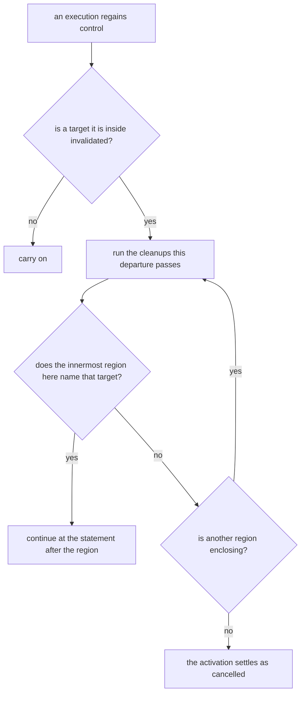

# Non-local control flow

How a program says "this scope can be left from anywhere within it", what each layer states about
it, and how a backend realizes it. The subject is the generic control construct, not any one use of
it: cancelling a running activity is built on this, and is not the same thing.

## The construct

One body, one landing. Execution anywhere dynamically inside the body -- including inside a callable
the body invoked -- can be sent to the landing, and continues at the statement after the region.

```systemverilog
initial begin : blk
  x = 1;
  disable blk;   // sends this execution to the landing
  x = 2;         // never runs
end
                 // the landing: execution continues here
```

Three properties make this more than a jump, and each one rules out a simpler mechanism:

| Property                                             | What it rules out                              |
| ---------------------------------------------------- | ---------------------------------------------- |
| The request can come from a different execution      | A local branch: the requester is not there     |
| It reaches executions any number of call frames deep | A lexical jump: the callee is not written here |
| One region can hold several concurrent executions    | Naming an execution: the region names a scope  |

## The four pieces

A language that supports this has exactly four things, and no fewer:

| Piece       | What it is                                                        |
| ----------- | ----------------------------------------------------------------- |
| **Target**  | The runtime identity a request names, one per region per instance |
| **Effect**  | A request in flight, carrying the target it names                 |
| **Region**  | A body plus the landing an effect naming its target reaches       |
| **Cleanup** | Work that runs on every way out of a body                         |

The cleanup is not optional. An execution can be sent to a landing from any point where it regains
control, so anything the body must release has to be released on a path the body did not choose.

## Two layers, and the split is the point

These four are not one layer. Two of them are language constructs and two are library values, and
mainstream languages draw the same line:

| Layer          | JVM world                                        | Here                                   |
| -------------- | ------------------------------------------------ | -------------------------------------- |
| Language       | `try` / `catch` / `finally`, and the raise       | The region, the raise, and the cleanup |
| Library on top | `Job`, `coroutineScope`, `CancellationException` | The target and the effect              |

Kotlin's cancellation is a library built on the JVM's exception and cleanup constructs; the JVM
knows nothing about cancellation. The same holds here: the semantic IR knows a region, a raise, and
a cleanup, and nothing about why a program would want them. What makes a target cancellable, when it
is invalidated, and who is woken are runtime-library concerns reached through ordinary calls.

The consequence to hold on to: **no control construct below the source language may name
cancellation.** The constructs a body carries stay generic; the library values they operate on, and
the calls that reach them, name whatever the runtime's own concepts are.

## Where the effect goes



Two things this diagram fixes. The effect is discovered where an execution regains control, never
delivered into the middle of a statement -- a simulated process cannot be made to run code partway
through a statement of the design. And every departure runs the cleanups it passes, before it
reaches the next landing.

## The one boundary a departure may not cross

Every frame in that diagram is one this compiler emitted, and a departure travels through them by
whatever means the target language gives it. A frame belonging to another language is not: it cannot
be unwound and it cannot be skipped, and it ends only by returning. So a departure stops there, and
what crosses in its place is a value that language's own convention defines -- for DPI-C, the int an
exported task hands its caller (LRM 35.8), which says whether a disable is active on this execution
thread.

Nothing is carried across. Whether a departure is due is answered rather than stored (invariant 5),
so the execution derives it again at the first frame of its own that it reaches, which is the call
that entered the foreign code. That call is the one place a body states the question for itself:
every other point at which an execution regains control is a resumption, which each target already
gates its own way, and a foreign call that consumed no simulation time suspended nothing there was a
resumption to hang it on.

## What each layer states

| Layer       | States                                                                    |
| ----------- | ------------------------------------------------------------------------- |
| Source-near | The construct the source wrote: a named block, a task                     |
| Semantic    | A region with its landing, a raise, and a body paired with a cleanup      |
| Execution   | Basic blocks and edges; the cleanup copied onto every way out of the body |
| Runtime     | Whether a target this execution is inside has been invalidated            |

The semantic layer states the construct once. The execution layer has no scopes -- only edges -- so
a body's ways out are enumerated there and the cleanup is emitted on each. A backend that consumes
the semantic layer directly does not enumerate anything: it hands the construct to its target
language.

## Core invariants

1. **A region is named by a value, not by a type or a lexical label.** The same region declaration
   exists once per instance, and several executions can be inside one at the same time, so neither a
   type nor a label distinguishes the one a request names.

2. **A body carries the region and nothing else.** A suspend, a call, and a request to leave are the
   same program whether or not any region encloses them. Discovering that a departure is due, and
   carrying it past frames that do not land it, are the runtime's.

3. **An extent's two ends are both stated.** Entering a region and leaving it are each an operation
   the program states. Marking membership with a value whose lifetime is the body's asks the target
   language to run code at scope exit, which is a facility only some have.

4. **A cleanup runs on every way out, and the ways out are enumerable.** Falling off the end, a
   return, a loop exit, and an effect passing through are all ways out. A layer with scopes gets
   this from the target language; a layer with only edges gets it by emitting the cleanup on each
   edge.

5. **Whether a departure is due is answered, never stored.** The answer is derived when asked, so
   nothing is queued and nothing has to be cleared. A region is re-entered under one identity -- a
   reentrant callable, a loop body -- so a one-shot mark cannot express "since this entry".

6. **A departure no region lands settles the activation, rather than returning a value.** An
   execution with nothing after the region to continue into ends; that outcome is the activation's,
   not a result its caller reads.

7. **Whether a call can leave is a property of its callee's declaration, never of what the callee
   does.** Nothing proves a callee cannot leave; one that cannot says so where it is declared. A
   proof would need the callee's body, which another unit may hold, and a call written before the
   proof existed would have to be revisited when it changed.

8. **A run-time error is the departure no region may claim from the first landing that receives
   it.** It is reported there, once, and then travels as every other departure does, so every
   cleanup it passes runs and it stops at a foreign frame's entry like the rest.

## Forbidden shapes

- **A control construct below the source language that means "cancellation".** What a body carries
  is a region, a raise, and a cleanup, each generic; a node or terminator meaning "cancel" has
  collapsed the language layer into the library one. A library value, and a call reaching one, is
  not this -- naming a target or an activation's outcome at the boundary to the runtime is naming
  the runtime's own concepts, which is what a boundary is for.

- **A region identified by an exception type.** A type cannot distinguish two instances of one
  declaration, which is what a request names.

- **An extent held by a value's lifetime.** It states the entry and leaves the exit to a target
  language's scope-exit rule, so a target without that rule cannot realize it, and the ways out that
  are easy to forget -- a return or a loop exit leaving the body -- are exactly the ones it hides.

- **A stored "a departure is due" flag.** It needs an owner, a clearing point, and a rule for a
  region re-entered before it was cleared. Deriving the answer needs none of the three.

- **A departure threaded across a callable boundary by the program.** A frame that lands nothing
  carries nothing for the departure; what crosses a boundary is the callee's own outcome.

- **A landing reached by an edge the execution layer does not show.** Every transfer is an edge
  there, including the one to a landing.

## Notes / Examples

The current semantic IR spells the three constructs `TryStmt` (the region and its landing),
`RaiseStmt` (passing a departure outward), and `FinallyStmt` (a body paired with a cleanup). The
runtime library spells the two values `CancellationTarget` and `ControlEffect`.

The C++ backend realizes the region as `try` / `catch`, the raise as `throw`, and the cleanup as a
scope-exit object declared ahead of the body -- C++ states an extent's exit through a destructor
rather than through a construct of its own. The execution backend has neither, so it emits the
cleanup on each way out of the body and asks the runtime, at the points inside a region where an
execution regains control, whether a target it is inside has been invalidated. A departure no region
of the body claims is itself one of those ways out: a body called directly carries it on to its
caller, and a body the runtime drives as a suspended execution completes and hands it to the
execution, the way a C++ coroutine hands an escaping exception to its promise. Both realize the
construct the way a C++ compiler realizes the same C++: a call is assumed able to leave unless its
callee is declared not to be, and that declaration is true because the callee's definition is
`noexcept` -- so a wrong one terminates rather than letting a departure slip past a landing.

Both backends' landings catch whatever the platform's unwinder carries and ask the runtime what it
was. A control effect is itself. A run-time error is settled there -- reported, the run ended, the
execution asked to stop -- and carried on as the departure no region may claim, so it is reported
once, by the first landing it reaches, and every cleanup after that runs as for any departure. The
release of a suspended stack, which must pass every frame untouched, the runtime raises again from
inside that question, unchanged. Which exception is which is a question only the language the
runtime is written in can answer, and naming that language's type identity from generated code would
make a fact of the runtime's own spelling -- its mangling, and which translation unit holds the one
definition of the identity -- something every artifact links against. Rust's `catch_unwind` has the
same shape for the same reason: its landing matches anything, and the runtime then decides from the
exception it was handed whether the raise was its own.

The execution backend keeps the scopes a departure can meet -- cleanups, the end of each value the
body owns, and regions alike -- on one stack in the order they nest, as Clang's exception handling
does. A call's landing belongs to the innermost scope open where it is made, so every call inside
one scope unwinds to the same landing; the landing receives what arrived and passes it to that
scope, whose cleanup runs once on the way out and passes it to the scope it is nested in, until a
region's handler or the frame's own edge takes it. A cleanup's code therefore appears once on the
unwinding path however many calls inside it can leave, while the ordinary ways out -- falling off
the end, a return, a loop exit -- still copy it, as below. A value whose end passes to storage or to
the caller stops being owed at that point, so the landings built while it was owed keep ending it
and those built afterwards do not.

Enumerating a body's ways out is what every compiler targeting a control-flow graph or a stack
machine does with a cleanup construct. JVM bytecode has no `finally`; the compiler copies the
cleanup onto each exit path. An earlier design jumped to one shared copy and returned, which was
withdrawn because the resulting graph could not be verified. Copying is the standard answer, and the
cost is one stack of owed cleanups in the lowering.

Adjacent contracts: `activation.md` owns what an activation is and which activations are cancelled
together; `lir.md` owns the control-flow graph the cleanup is emitted into; `mir.md` owns the
semantic layer's primitive set; `scheduling.md` owns the engine that resumes an execution at the
points where it can discover a departure.
