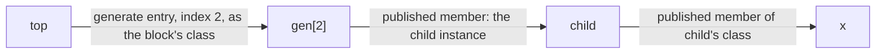

# Reference Resolution

## Purpose

Define how a reference reaches its target. A route from referrer to target is an anchor, a sequence
of typed steps and a leaf, each compiled against a declaration the referrer has for it. The same
resolution serves both accessing the target's value and observing its changes.

## Owns

- The decomposition of a reference's route into an anchor, steps and a leaf, and the rule that every
  step and leaf is compiled against a declaration the referrer has for its target.
- The rule that a step realizes as typed navigation -- through an in-artifact member identity, or
  through a member the target scope published, resolved at the referrer's compile time -- and that a
  name the target scope did not publish is refused where the referrer compiles.
- The anchor of an upward name: the enclosing instance of the class the front end's search landed
  on.
- The contract that route execution is total: a route that fails to seal is either a
  user-diagnosable elaboration error (a non-constructed target, a forwarding cycle with no storage
  root) or a compiler-invariant violation, never a runtime fallback.
- The contract that port connections, hierarchical references, and cross-instance trigger
  subscriptions all flow through the same binding-graph route mechanism. No form has its own
  parallel resolution.
- The contract that a sealed endpoint serves both value access and change observation through one
  stored reference.
- The rule that a route whose leaf is an object reference seals how to reach the target rather than
  where the target is, and that a name continuing past it is an access compiled against the class
  the reached storage was declared with.
- The rule that connectivity is linkage between objects and never alters what an object owns.

## Does Not Own

- The shape of the object graph, the construction order, and the graph's faithfulness to the
  frontend's elaboration (see `hierarchy_and_generate.md`). This doc relies on that faithfulness but
  does not establish it.
- What each unit kind and each scope publishes, which is what decides which names a referrer may
  reach (see `compilation_unit_model.md`).
- The compile-time identity kinds used to thread route steps (see `identity_and_ownership.md`,
  `hir.md`, `mir.md`).
- The lexical axis of reference: how a value reference names a binding in its own callable body, and
  how a binding crosses a closure boundary by capture (see `binding_and_capture.md`). This doc owns
  the object-graph and cross-unit axis; a multi-segment reference splits cleanly between the two,
  with the receiver value resolved lexically and the object-graph hops resolved here.
- How an observed change wakes a dependent process (see `scheduling.md`).
- Storage placement and offsets of members (see `lir.md`).
- The phases the route executes in (see `elaboration_lifecycle.md`).
- Net resolution, and what it means for a connection to join two nets into one of them. That is a
  design-global net-resolution concern, separate from per-object reference resolution;
  `net_resolution.md` owns it and reaches both the drivers and the joined net through this route.

## Core Invariants

1. Every reference is a route from a structural origin to an endpoint. The route is an anchor, a
   sequence of steps and a leaf; the endpoint is the canonical access point for every read, write,
   and observation against the reference.
2. Every step and every leaf is compiled against a declaration the referrer has for its target: a
   class its own artifact owns, or a member the target scope published. Its realization is typed
   navigation, with no string lookup and no runtime call naming the target at simulation or
   elaboration time, and no part of a route carries a string. A step is one element of the path the
   source wrote (LRM 23.6), the declaration it names and the selects written beside that name, so
   every kind of step selects the same way. A step onto an instance is the published member holding
   it, selected; a step into a loop's block is the construct's published entry, selected by the
   block's position; a step into a block a conditional chose is the construct's entry, which holds
   at most one object and takes no select. Either block step views what it reached as that block's
   published class. A leaf is a published member, a published disable target, or a direct call to a
   published subroutine.

   A step's identity comes from one of two places, which changes nothing about its cost or its
   realization: an in-artifact member identity when the emitting artifact owns both classes, and the
   member's name resolved against the target's publication at the referrer's compile time when it
   does not. A name the target scope did not publish has no declaration to compile against and is
   refused there, as a compile error and never as a run-time failure.

3. A route that descends into a scope or crosses into another instance executes once during the
   binding-graph phase, producing a candidate endpoint; the endpoint is committed at the sealing
   barrier and read directly thereafter. A route of parent edges within the instance passes nothing
   that can be missing, so it executes nowhere ahead of time: its access follows those edges, a
   fixed number of loads. Either way simulation-time access performs no lookup, no descent, and no
   name matching, and one endpoint serves both value access and change observation.
4. Route execution is total in the architecture's contract. The frontend fully elaborates and
   validates every reference, and the constructed object graph is faithful to that elaboration (see
   `hierarchy_and_generate.md`). A reference to a non-constructed runtime target (a non-selected
   conditional-generate arm, an out-of-range instance-array element) is rejected at the sealing
   barrier with a user diagnostic; a route whose steps cannot otherwise execute is an
   `InternalError`.
5. Port connections, hierarchical references, and cross-instance trigger subscriptions share one
   route mechanism. There is no parallel resolution path per reference kind, per direction, or per
   lexical form.
6. Connectivity is linkage between objects. It never removes the object's storage, never changes the
   object's layout, and never makes a member's addressing depend on what it is wired to. Nets are no
   exception: joining two of them into one resolution is a design-global net-resolution concern
   outside this contract, and it leaves both nets' storage and addressing exactly as they were.
7. The endpoint inherits the access protocol of the target it reaches. A reference to an observable
   storage cell reads and writes through the cell's protocol; a reference to an event participates
   in the event's protocol. The endpoint is not a new access category; it is the target's access
   surface reached through a sealed direct path.
8. A route whose leaf is an object reference seals **how to reach** the target, not **where** the
   target is. The reference's value is a value the design computes and overwrites, so no address
   survives sealing; what the route commits is the storage holding the object reference. Where the
   source continues into a property or a behavior, the body reads the reference at each access and
   applies an ordinary member access to whichever object it holds. The class that access is compiled
   against is the one the reached storage was **declared** with, which the declaring scope
   published, never the one an object turns out to be: a reference commonly names no object at all
   when its route seals, and which property an access reaches is fixed by the class the access names
   rather than by what it runs on.
9. Resolving a name against a class is not choosing which override runs. A property resolves to its
   member and a behavior to a body. For a virtual behavior that is the virtual call on the object
   the reference holds, so which override finally runs is still the object's own answer at the
   moment of the call, and no route commits it.
10. An upward name (LRM 23.8) is anchored at the nearest enclosing instance of the class the front
    end's search landed on -- or, past the topmost, a top-level instance of it -- reached by one
    runtime query and a static downcast to that class. Which class the search lands on is part of
    what tells a referrer's unit apart (LRM 23.8 resolves an upward name per instance, so two
    instances of one definition may land on different declarations of different types), and a route
    never carries a type that differs between the instances sharing its code.

## Boundary to Adjacent Layers

- `compilation_unit_model.md` owns the signature each unit kind publishes, which is what decides
  which names a referrer outside the unit may reach.
- `hierarchy_and_generate.md` owns the object graph the routes navigate and the faithfulness of that
  graph to the frontend's elaboration that makes route execution total.
- `runtime_model.md` places route execution in the constructor context (the binding-graph phases at
  t = 0) and access in the simulation context (t >= 0).
- `elaboration_lifecycle.md` owns _when_ a route executes and seals. A route that descends or
  crosses an instance executes in Resolve and its endpoint commits in Seal; one of parent edges is
  walked where it is used.
- `identity_and_ownership.md` owns the identity rules that route steps thread.
- `scheduling.md` owns the wakeup that fires when a sealed endpoint's underlying cell changes.

## Forbidden Shapes

- Compiled body code that depends on another unit's layout beyond what that unit published. The
  published part is what a referrer compiles against; reaching into what the realization adds is the
  canonical artifact-boundary violation, since lowering moves it with every body edit.
- Route mechanism dispatched on the frontend's lexical-form classification or on source order. Every
  step is the same kind of typed step whatever form named the target, and the form is not visible
  past the AST-to-HIR boundary.
- Resolving a hierarchical name by its text while the design elaborates or runs: a scope registering
  its signals, statics or disable targets under their names, a search of child scopes by name, a
  scope or class carrying a table of subroutine or member names, or a route carrying a string for
  the runtime to match. A name resolved that way surfaces a misspelling or a type that differs
  between instances at run time or not at all, leaves an unchecked cast where a compile-time check
  belonged, and makes every instance pay a registration per declaration. A scope's hierarchy segment
  for `%m` and a class's DPI-C export table are not this: neither resolves a hierarchical name.
- A reference shape per direction or per lexical form (as separate species). One semantic shape; one
  route decomposition.
- Resolution driven from the target's side: the referenced unit wiring, pushing, or storing its own
  member into the units that reference it. A unit compiles against its own signature and cannot know
  who references it, so it never drives resolution for a consumer and never carries a list of its
  referrers. Every route is driven by the referrer, through what the target published.
- A typed step naming a declaration the target scope did not publish -- something lowering added to
  its realization, such as a route's slot, process state or a closure's home. What decides is
  publication: a name reaching a declaration that is not published is refused where the referrer
  compiles, and never falls back to another way of reaching it.
- A resolution path for ports that is distinct from the one for hierarchical references. Two
  mechanisms for cross-instance access is the canonical violation.
- Resolution by flattened symbol-name lookup or a design-global path table that mirrors the object
  graph.
- A per-access runtime lookup on the simulation path. A route that descends or crosses an instance
  executes once during elaboration and the hot path reads its sealed endpoint. A hot-path read that
  descends the hierarchy or looks a name up is the canonical hot-path violation; following a fixed
  number of parent edges is neither.
- A route that seals an object reference to the address of whichever object it held at sealing. The
  reference's value is the design's to change, so such an endpoint is correct only until the first
  assignment and silently wrong afterwards.
- A source name carried into a body to be resolved against an object there. The name is resolved
  where the referrer compiles, against the class the storage was declared with.
- Elaboration choosing which override a virtual behavior runs. The access makes the virtual call,
  and the object answers which override that call reaches.
- An access compiled against a class the referrer assumed rather than the class the reached storage
  was declared with. A position read off the wrong class addresses whatever sits at that position in
  another class's layout, with nothing to catch it.
- Reaching another unit's declaration by arranging for the two sides' representations to agree,
  rather than through the class both compile against. Agreement in layout is a target language's
  choice and holds for some shapes and not others, so what it produces is a failure confined to the
  shapes where it does not hold.
- A referrer's unit told apart by where an instance sits -- the length or path of an upward name's
  climb. It splits units that compile to the same code; the class the climb lands on is what changes
  the code, and it is what tells the unit apart.
- A route keyed or resolved by a design-global coordinate, ordinal, or instance id.
- A reference whose sealing failure is silently swallowed at runtime. A user-diagnosable failure
  (non-constructed target, forwarding cycle without storage root) surfaces a user diagnostic; an
  impossible-by-contract failure raises `InternalError`. There is no runtime fallback.
- A binding installed in the constructor block. Routes execute in Resolve and seal in Seal; ctor
  allocates the shell only.
- A runtime library wrapper for a particular resolver strategy appearing as an IR concept. Wrappers
  belong to the runtime; HIR and MIR vocabulary names only the reference, its route, and its
  endpoint.
- A forwarding wrapper observed on the hot path. Forwarding chains collapse to the final endpoint at
  sealing; a sealed endpoint reaches its target directly.
- Connectivity that eliminates an object's local storage for a member, or that changes the object's
  layout based on what the member is wired to.
- Member addressing that differs between a wired and an unwired member.

## Notes / Examples

**Same-unit sibling reference.** `always_comb from_b = b.bx;` inside generate block `a` of `Top`,
where `b` is a sibling generate of `a`. The route has two parts: `a -> Top` (the typed parent edge)
and `Top -> b -> bx` (typed member access into the sibling generate's class then into its variable).
Both are typed against classes the referrer's own artifact holds: `Top`'s artifact owns `a`'s class,
`b`'s class, and the `bx` member. The route executes the typed chain once and seals to the
variable's cell. The mechanism does not depend on whether `a` is declared before or after `b`.

**A port and an internal variable are reached alike.** `always_comb r = c.p;` and
`always_comb r = c.x;` inside a parent module, where `c` is a child module instance, `p` is one of
its ports, and `x` is an internal variable. Both routes begin with the same step `parent -> c`,
reached through the `c` member's pointer type the parent's artifact owns, and both end at a member
of `c`'s published class: the child publishes every data object a hierarchical name may reach, not
only its ports. A renamed `p` or `x` fails where the parent compiles, and a name the child never
declared is refused there too. Both seal to a cell, and the body and its sensitivity read the sealed
endpoint.

**A route through generate blocks and another unit.** In `top.gen[2].child.x`, `top -> gen[2]` is
the loop construct's published entry selected at the block's position and viewed as the block's
published class, `gen[2] -> child` is the published member holding the child instance, and
`child -> x` is a member of `child`'s published class. Every step is typed, whether its class
belongs to the referrer's own artifact or another unit published it.

Nothing about a route is decided by how many units it crosses, by how deep it goes, or by the syntax
that named the target; every step is the same kind of typed step.

**An upward name.** `always_comb y = Top.g;` inside a module instantiated somewhere below `Top`. The
front end's search lands on `Top`'s class; the route's anchor is the nearest enclosing instance of
that class, found by one runtime query and a static downcast, and `g` is a member of `Top`'s
published class. Another instance of the same module whose search landed on a different class is a
different unit, so neither carries a type the other would need.

**A route that continues past an object reference.** `holder.h.tag`, where `h` is a class-typed
variable of another unit and the class is declared inside that unit's design element. The step
reaching `h` is a published member like any other, and the class `h` is declared with is published
by that element. What follows is not another step of the same kind: `tag` is a property of an
object, and which object is a value `holder` overwrites whenever it likes. So the route seals the
storage holding the reference, and the body reads the reference and applies an ordinary member
access for `tag` to whichever object it holds. Replacing `tag` with a virtual behavior makes the
access a virtual call, with the object still answering which override that call reaches.
`holder.q[0].tag` is the same picture with a collection in the middle.

**Port connections share the routing.** An input or output port is a continuous-assignment edge
between the two objects' own storage (LRM 23.3.3); the cross-unit side reaches the partner cell
through one route, whose leaf is a member of the module's published class. A `ref` port (LRM
23.3.3.2) is a forwarding link that resolves to the connected cell at sealing. An `inout` port
reaches the child's net through the same route and then joins it to the parent's into one resolution
(`net_resolution.md`), which is a fact about the two nets rather than a second way of reaching one.
Every form whose cross-instance reach passes through Resolve shares the one route mechanism.

**Routing is deferred to Resolve, not dynamic.** The deferral keeps each unit independently and
incrementally compilable; it carries no semantic uncertainty. The frontend has already proven every
reference has a determinate target, so route execution always succeeds (or surfaces a
user-diagnosable elaboration error at the sealing barrier).
