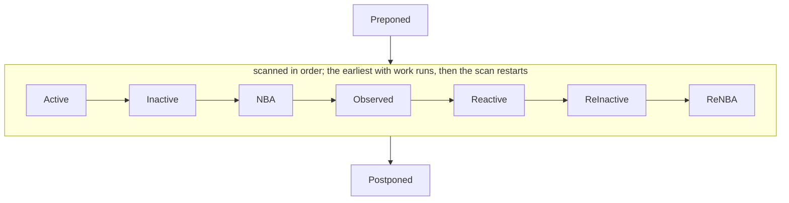

# Scheduling

A lyra simulation runs as a set of coroutines coordinated by a stratified event scheduler. Each
SystemVerilog process -- `initial`, `always*`, `final` -- compiles to a C++ coroutine. The scheduler
pulls coroutines from time-slot region queues and resumes them; a coroutine runs until it suspends,
and lands on whichever queue its own `await_suspend` chose. Deferred effects (`<=` writes, `$strobe`
prints) are not yields: the coroutine snapshots its inputs into a closure, hands the closure to the
engine, and continues running. The engine invokes those closures when their owning region runs.

This doc covers the decisions behind the engine itself: process model, suspension protocol, region
structure, deferred work, `$finish` semantics, and the MIR boundary. Sensitivity tracking, change
detection, and edge detection are separate runtime subsystems.

## Processes and tasks are coroutines

The execution instance a process or task runs as -- its identity, completion outcome, ownership, and
cancellation -- is the activation, defined in `activation.md`. This doc owns the engine that parks
and resumes activations; `activation.md` owns what an activation is. The scheduler holds an
activation token (a payload-neutral handle) and never sees an activation's completion type.

A process body -- and a task body, which may consume time -- compiles into a `Coroutine`. The
scheduler holds the activation token and resumes the body; a `co_await` in the body suspends it
again. Process state -- procedural locals, the implicit program counter -- lives in the coroutine
frame, which the engine does not introspect.

A task is enabled with `co_await`: enabling a time-consuming task suspends the enabling process
until the task completes (LRM 13.3). The scheduler resumes the innermost suspended frame, and each
completed task transfers control back to its enabler, so suspension flows through the whole enable
chain without the engine tracking call depth.

Fibers are rejected: per-process stacks would multiply memory by orders of magnitude for any
nontrivial design. Coroutine frames hold only the locals live across suspension points. Hand-rolled
state machines are rejected: they would force HIR-to-MIR lowering to thread resumption state through
every statement that might suspend, defeating the structured form MIR is designed to carry.

## The engine is a mechanism, not a semantics holder

The engine does three things: it holds queues of runnable coroutine handles, it resumes them, and it
parks each one on whichever queue the code it just ran asked for. It never inspects what a coroutine
represents, why it suspended, or what it waits for. A coroutine frame is opaque to it.

Construct semantics live entirely in awaitables. A `co_await` suspends the coroutine and, in
`await_suspend`, reaches back to a small fixed set of construct-neutral scheduling verbs. What those
verbs take is a **placement** -- which time slot, and which region of it -- because that is what an
LRM 4.4 event is: a time, a region, and the thing to do there. An awaitable places its activation; a
satisfied wait wakes one into the Active region of the current slot; a spawning construct may adopt
a coroutine and place it; and a construct may ask that the simulation stop. The verbs name _where
and when_ a handle becomes runnable again, never _why_. Distinct constructs -- a delay, an event
wait, a task enable -- bottom out in the same verbs, and the engine cannot tell them apart.

Taking the placement as an argument rather than encoding it in the verb's name is what keeps the set
complete. A verb per combination covers points of that space and leaves the rest unreachable, and a
missing combination is invisible, because it is the absence of a name and nothing reports a name
nobody wrote. A nonblocking assignment carrying a delay wants the NBA region of a future slot; a set
that can say "a future slot" only about the Active region has nowhere to put it, and says so by
being silent.

This is the division a host event loop draws: the loop runs its queues and knows nothing of the
timers, I/O, or callbacks that fill them; the meaning lives in the APIs that enqueue, not in the
loop. The payoff is additivity. A suspending construct is added by writing a new awaitable that
schedules through the existing verbs; a process-spawning construct may also add one
construct-neutral verb (adopt a coroutine and schedule it). Either way the engine gains no
per-construct branch.

**Invariant:** the engine branches only on queue and region, never on the kind of construct a
coroutine came from. **Forbidden:** a per-construct case inside the engine's resume or dispatch
path; a priority field or out-of-band note a coroutine leaves for the scheduler to read. When a
construct seems to require the engine to ask "is this an X?", the neutral verb set is missing a
primitive -- add the primitive, do not teach the engine the construct.

## Deferred work is a closure submit, not a suspension

When a process needs an effect to happen later -- a non-blocking write to a signal, a postponed
`$strobe` print -- it does not yield. It snapshots its inputs into a closure (see `mir.md` for the
MIR-level shape) and submits the closure to a placement, then keeps running. A submit takes the same
placement a suspension does, which is what lets a nonblocking assignment carrying a delay reach the
NBA region of a later slot (LRM 4.4.2.4, 10.4.2) with no second mechanism.

Yield-based alternatives are rejected because they would entangle the deferred effect's commit time
with the process's resumption schedule. A process that does `q <= d; #5; ...` should not be forced
to suspend before `#5` just because the NBA write has not yet committed; the write commits in the
NBA region of this same time slot regardless of where the process is by then.

**Forbidden:** routing deferred writes into per-signal queues. Every closure is submitted to one
region queue, so commit order is the region's, not a function of which signal a write targets.

## Region structure

A time slot runs regions in LRM 4.4 order: Preponed, Active, Inactive, NBA, Observed, Reactive,
ReInactive, ReNBA, Postponed. That clause's PLI regions are absent, because there is no PLI.

Preponed runs once on entry and Postponed once on exit. Between them the slot repeats one step: take
the earliest region from Active through ReNBA that has anything pending, run it, and look again.
Running a region produces work that lands back in the slot -- an NBA commit wakes a process into
Active, a resumed process submits an NBA -- so the step repeats until nothing between those two
bounds is left.

That one step is LRM 4.5's loop. The reference algorithm writes it as moving the earliest nonempty
region's events into Active and running Active again; running the region where it stands reaches the
same order, since a region later in the list is reached only once everything before it is empty, and
whatever it schedules earlier is found first on the next look.

Two consequences carry the weight. A process woken by a blocking write runs while the active set
drains, before the NBA region commits the nonblocking writes issued beside it -- deferring it past
NBA is the classic wrong answer, because the process then reads values that in the standard's order
it cannot yet see. And a process woken by an NBA commit belongs to the slot whose NBA woke it, so it
runs before that slot's Observed region rather than being pushed to the next time slot.

The reactive group (Reactive, ReInactive, ReNBA) is reached only when the active group has drained,
which the one ordering rule already gives. It holds program-block statements, checker code, and the
action blocks of concurrent assertions; none of those are implemented, so the three regions exist
and stay empty. Preponed is the same: `#1step` sampling is what fills it.

`#0` delays land in **Inactive**, not Active. A user writing `#0` is asking the engine to let other
already-pending active work finish first, then come back at this same simulation time. Pushing
`#0`-suspended processes to the back of Active would let them re-enter ahead of work that arrived
earlier, defeating the intent.

## `$finish`

`$finish` reaches the engine's stop verb, which sets a stop flag. No process resumes after it: the
flag is read where a process would be entered, so whatever is still parked in the in-progress slot
is drained without running a statement.

Deferred effects already submitted for that slot do still run, so a nonblocking write issued before
the `$finish` commits and a `final` procedure can read it. LRM 20.2 says only that `$finish` makes
the simulator exit and does not say how much of the in-progress slot still happens, so this is a
choice rather than a requirement -- which is why the corpus does not hold a case for it.

Registered `final` actions then run in registration order. A `$finish` raised from inside a `final`
aborts the remaining finals (LRM 9.2.3).

## Closure capture lifetime

A closure's captures are either by-value or by-reference (see `mir.md` for the MIR-level shape). The
two have different lifetime rules:

- **By-value capture** is always safe. The snapshot lives inside the closure's storage; the engine
  destroys it when the closure fires or when the closure is dropped without firing.
- **By-reference capture of a `StructuralVarRef`** is always safe. Structural-scope storage
  (module-level variables) lives for the entire simulation; any closure can hold a reference into it
  indefinitely.
- **By-reference capture of a `ProceduralVarRef`** is safe only if the closure fires while the
  process's coroutine frame is still alive. The procedural frame is destroyed when the process body
  returns or when `$finish` tears down the simulation; references into the frame are invalid after
  either event.

The third case is the one a lowering pass must reason about. A lowering that emits a closure
capturing a procedural lvalue is responsible for establishing the fire-before-frame-dies guarantee,
or it must refuse the capture.

## MIR boundary: a place model, not storage layout

MIR carries a place model in the shape of Rust MIR and LLVM IR: a borrowed pointer type, `DerefExpr`
(pointer -> place) and its dual `AddressOfExpr` (place -> pointer), a reference type for `ref`
formals and alias captures, a pointer cast, and a null pointer literal. `self` is a borrowed
pointer. What MIR does not carry is storage _layout_ -- offsets, byte sizes, alignment -- which
belongs to LIR; the engine, not MIR, owns where storage lives. See
`decisions/address-of-primitive.md`.

The deferred-write pattern -- "this place, written later" for an NBA commit, a postponed strobe, a
callback -- is still expressed as a closure whose capture list owns the place. Whether a captured
field is a snapshot or an alias is the field's _type_: a value-typed field is a snapshot, a
reference-typed field aliases the live storage (LRM 6.21). The discipline is that a place held
across a suspension or a region boundary is a reference-typed capture field, not raw pointer
arithmetic threaded by hand. The C++ backend realizes such a field as an owned reference value (a
`Ref<T>` by-value capture, never a `&` lambda capture), so a write through it still wakes the cell's
subscribers and nothing dangles when the closure outlives the frame that built it.
