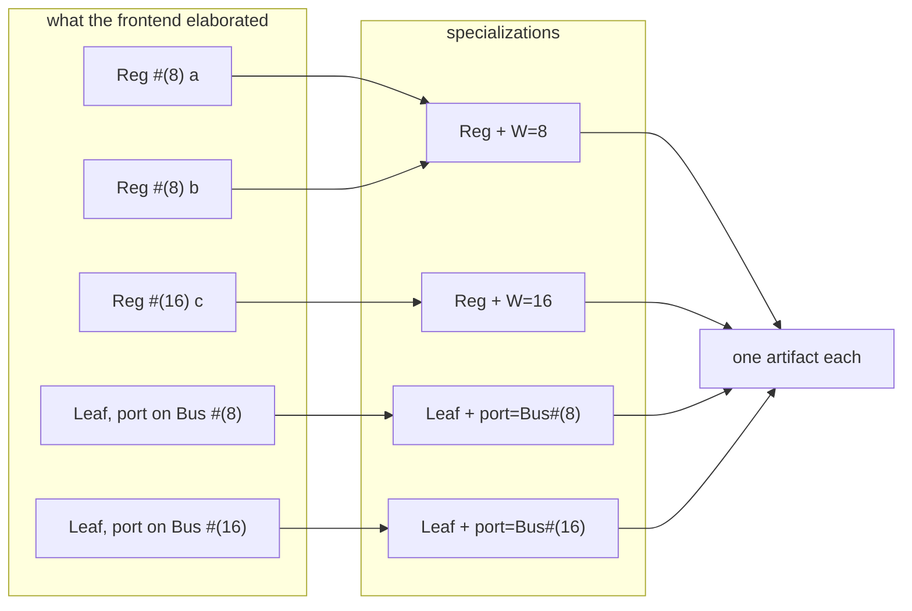
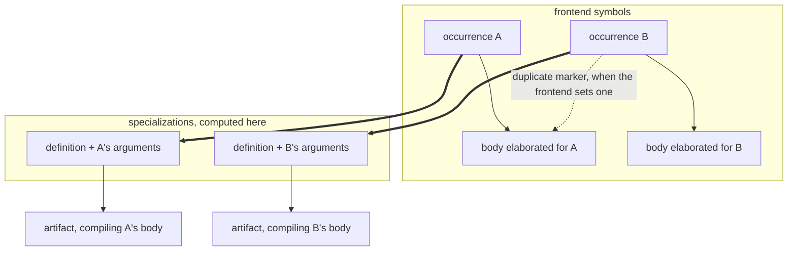

# Specialization Model

## Purpose

**A specialization is a definition applied to arguments.** `Reg #(8)` is the definition `Reg` with
`W` fixed to 8; `Leaf` connected to a `Bus #(16)` is the definition `Leaf` with its port fixed to
that interface. Everything in this doc follows from taking that sentence literally: what counts as
an argument, when two applications are the same one, and what the compiler produces per application
rather than per instance.

This doc defines what a specialization is, when a new one is created, and what stays shared across
instances that match one. Specialization is also the compile-time **sharing optimization**: the
correctness baseline is concrete elaboration -- every distinct parameter binding resolved to its own
concrete artifact -- and a shared specialization is admitted only when distinct concrete forms are
proven to behave identically under one artifact. Parameter classification is the **eligibility
filter** for that sharing, never a correctness requirement; where sharing cannot be proven, concrete
artifacts are retained, which is a correct outcome (an optimization miss, not a failure).

## The two questions

Everything here is one of these, and they are not the same question.

**What makes two instances the same specialization?** The definition, and the arguments. Two
instances agreeing on both compile to the same code, so they are one specialization and share one
artifact; disagreeing anywhere, they are two. The number of instances that agree never enters into
it -- ten thousand `Reg #(8)` are one specialization, and the compiler's work does not grow with
them.

**How do two separately compiled units agree on which one they mean?** They cannot look each other
up: a unit compiles from its own contents and the signatures it consumes, with no table between
them. So both sides derive the answer from the same inputs by the same function, and match on the
result. That is why a specialization has a _name_ at all -- a name is the only identity that
survives crossing a boundary two units share nothing across.

The second question is what makes the first one strict. If identity were only ever compared inside
one compiler run, an ordinary object comparison would do. Because a parent naming a child and the
child naming itself must reach one answer independently, the identity has to be a pure function of
what both can see -- and it has to be renderable as a name they can both write down.



Five instances, four specializations, four artifacts. `a` and `b` collapse because their arguments
agree. `D` and `E` do not, even though neither writes a parameter -- which is the point of the next
section.

## What counts as an argument

An argument is anything the parent fixes at the instantiation site that changes the compiled code.
That is the whole test. It is **not** "what was written as a parameter", and the difference is not a
corner case:

```systemverilog
interface Bus #(parameter int W = 8);
  logic [W-1:0] data;
endinterface

module Leaf (Bus b);          // no parameters at all
  initial b.data = 3;
endmodule

module Top;
  Bus #(8)  narrow ();
  Bus #(16) wide ();
  Leaf on_narrow (.b(narrow));   // b.data is 8 bits
  Leaf on_wide   (.b(wide));     // b.data is 16 bits
endmodule
```

`Leaf` declares no parameter, and SystemVerilog gives no way to declare one for this: a port list
names the interface _definition_, and `Bus #(8) b` there is rejected. So `Leaf` is generic over its
interface, and the connection is where the argument is deduced rather than written. Two `Leaf`
instances bound to different interfaces reach different types at different member positions, so they
are two specializations -- exactly as two parameter bindings would be.

Read as templates, with the argument deduced rather than written:

```
interface Bus #(int W);   ~   template <int W> struct Bus { ... };
module Leaf (Bus b);      ~   template <class B> struct Leaf { B* b; };
Leaf on_narrow (.b(narrow));  ~   Leaf<Bus<8>> on_narrow{&narrow};
```

`Bus` is not a base class and `Bus #(8)` is not derived from it: two specializations of one
interface share a name and a source text and nothing else, and neither is substitutable for the
other.

## What the frontend supplies, and what it does not

The frontend elaborates the design into symbols, and two of them correspond to concepts here:

| This model                                     | Frontend symbol                          |
| ---------------------------------------------- | ---------------------------------------- |
| An occurrence of a definition in the hierarchy | an instance                              |
| The contents elaborated for that occurrence    | that instance's body, one per occurrence |
| A specialization                               | nothing                                  |

The third row is empty because the frontend generates no code and so never has to answer how many
artifacts a definition compiles to. What it does answer, for its own traversal, is whether one body
duplicates another closely enough that visiting it again would be wasted work, and it records that
as a pointer from the second occurrence to the first one's body.

That pointer is bookkeeping about elaboration work. It has the same shape as the question this model
answers -- which occurrences may share -- and it is a different relation, computed for a different
purpose, free to be coarser or finer. `front-end-semantic-boundary.md` establishes that a semantic
fact the frontend resolved is translated here rather than re-derived; the frontend's account of its
own work is not such a fact, and translating it puts a correctness decision in the keeping of an
optimization.



Each occurrence has a body of its own, elaborated under what its own parent fixed. The heavy arrows
are this model: an occurrence belongs to the specialization its arguments say it does, and the
artifact for that specialization compiles a body elaborated for an occurrence in it.

The dotted arrow is drawn to be ignored. Whether the frontend sets it, and whether where it sets it
coincides with where the heavy arrows meet, are both properties of the frontend's own traversal, and
this model reads the same either way -- which is what makes it a model rather than a restatement of
what the frontend happened to do.

## Owns

- The definition of a specialization: a compilation unit together with the set of inputs that change
  compiled code shape.
- The correspondence between this model and the frontend's symbol graph, including which of its
  records are inputs here and which are not.
- The classification of parameters into code-shape-affecting inputs and constructor/config inputs.
- The rule that one specialization produces one compile-time artifact, shared by every instance that
  matches.
- The rule for what may vary within one specialization vs what forces a new specialization.

## Does Not Own

- The internal shape of a compilation unit (see `compilation_unit_model.md`).
- Identity kinds inside a specialization (see `identity_and_ownership.md`).
- Cache keys for incremental reuse (see `incremental_build.md`). Specialization keys feed into that
  cache, but this doc does not define the cache's contract.

## Core Invariants

1. **Concrete elaboration is the correctness baseline; sharing is the optimization.** Every accepted
   program has a correct concrete lowering in which each distinct parameter binding is its own
   artifact. A specialization that shares one artifact across distinct bindings is admitted only
   when proven behavior-preserving; absent that proof, the concrete artifacts are retained.
   Correctness never depends on classification or on proving sharing.
2. **Specialization is driven by code-shape differences, not by instance count.** A new
   specialization is created only when compiled code shape actually differs between two potential
   instances. The number of instances that match a specialization does not affect how many
   specializations exist.
3. **Parameters are classified as a sharing-eligibility filter.** Every parameter is either a
   **code-shape-affecting input** (enters the specialization key) or a **constructor/config input**
   (flows in at runtime construction, does not enter the key). The classification is explicit and
   stable, and it widens what may share one artifact; it is never a precondition for lowering a
   program correctly.
4. **Code-shape-affecting inputs are exactly those that change generated code.** Packed bit widths
   used in types, type substitutions for `parameter type`, and structural decisions that change the
   set of emitted instructions are code-shape-affecting. Nothing else.
5. **Constructor/config inputs do not fork the specialization.** Initial values, counts that only
   steer runtime state, enable/disable flags that do not change generated code, and values consumed
   only by the runtime constructor flow through as inputs. They do not produce additional
   compile-time artifacts.
6. **One specialization compiles once.** Every instance that matches a specialization shares the
   same compile-time artifact. Two instances with identical specialization keys are
   indistinguishable at compile time.
7. **Specialization keys are stable and deterministic.** Given a compilation unit and its
   code-shape-affecting inputs, the specialization key is fully determined. Keys do not depend on
   traversal order, instance enumeration, or the order in which instances are encountered.
8. **A specialization is computed from occurrences, and the artifact compiles a body elaborated for
   one of them.** Every argument is read where a parent fixed it, which is the occurrence. The body
   an artifact compiles is one elaborated under those same arguments, so what it was named for and
   what it compiles against are one application; a body elaborated for a different application
   states different types at the same positions. The frontend's record that two bodies duplicate
   each other is an input to neither half.
9. **Producer and consumer derive the identity independently and agree.** A unit's own identity and
   the identity a parent means when it instantiates that unit are computed from the same inputs by
   the same function, with no table between them -- which is what lets units compile in any order
   and in isolation. A name is how that identity crosses the boundary; the identity is what decides
   whether two applications are the same, and a name that no longer tells two of them apart is a
   defect in the naming, not a second definition of identity.

## Boundary to Adjacent Layers

- `compilation_unit_model.md` defines the compilation unit. This doc defines how parameter values
  refine a compilation unit into specializations.
- `incremental_build.md` uses specialization keys as cache keys. The rules in this doc are upstream
  of incremental reuse.
- Each IR layer's shape is per-specialization, not per-instance. See the individual IR docs for how
  a specialization manifests in HIR, MIR, and LIR.

## Forbidden Shapes

- A specialization keyed on a parameter that does not change compiled code shape.
- In the optimized steady state, leaving every distinct parameter binding as its own specialization
  without checking whether the values change code shape. The concrete baseline of invariant 1 does
  exactly this and is correct; the sharing optimization must not stop there.
- Using runtime-only state (counter initial values, enable flags, sizes that the runtime constructor
  handles) as part of the specialization key.
- Specialization keys derived from instance path, instance ordinal, or instance enumeration.
- Deriving a specialization, or which artifact an occurrence belongs to, from the frontend's record
  that two bodies duplicate each other. Its subject is whether elaboration must be repeated, and a
  relation of the same shape computed for another purpose is not evidence about compiled behavior.
- Compiling, for one specialization, a body elaborated for an occurrence outside it.
- An identity stored as the name it renders to, so that two applications are told apart by comparing
  renderings. A name drops whatever the target it is written for recovers by other means; an
  identity may drop nothing. Where the two are one value, the day they disagree is silent.
- A shared table, registry, or ordinal that both a unit and its instantiator consult to agree on
  which specialization is meant. Agreement comes from computing the same function, never from
  reading the same place.
- Silently reclassifying a constructor input as a code-shape input to simplify codegen.
- An input that appears on both axes (code-shape and constructor) simultaneously. Each input has
  exactly one classification.
- Forking a specialization per instance, or allowing instance count to drive the number of
  specializations.
- Rejecting a program because a parameter cannot be classified. The correct fallback is concrete
  specialization, never rejection.

## Notes / Examples

`parameter int W = 8` used as `logic [W-1:0] data`: W changes the packed width of generated code. W
is code-shape-affecting. Instances with different W values belong to different specializations.

`parameter int INIT = 0` used only as the initial value of a register: INIT does not change
generated code. INIT is a constructor input. Instances with different INIT values share one
specialization and differ only in constructor inputs.

`parameter int N` controlling a `generate for` that instantiates N children: the compiled
constructor loops N times, producing N child objects. The compilation unit's compiled code does not
depend on N. N is a constructor input; the unit compiles once for any N.

`parameter type T = int` substituting a type parameter: T changes emitted types and operations. T is
code-shape-affecting. Distinct types produce distinct specializations. "Distinct" is the IR's own
type identity, which is structural except where SystemVerilog identifies a type by its declaration:
two structurally identical packed structs are one type and share one specialization, while two
classes of the same name declared in different units are two.
