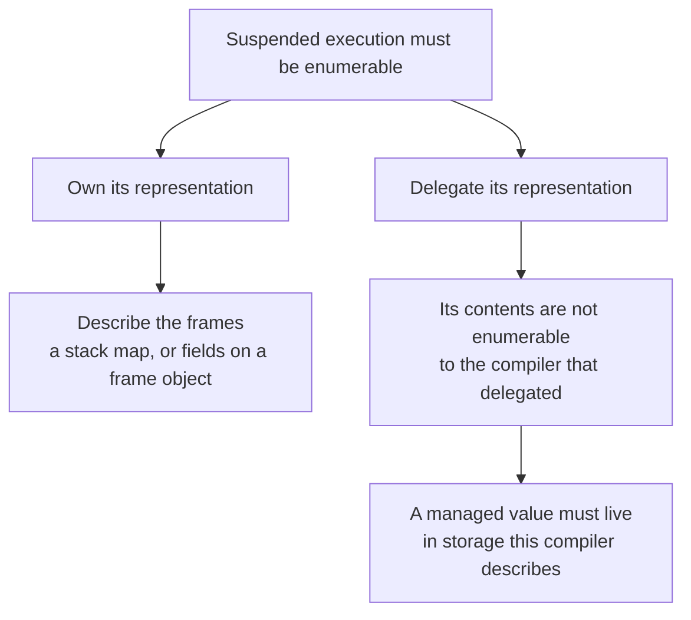
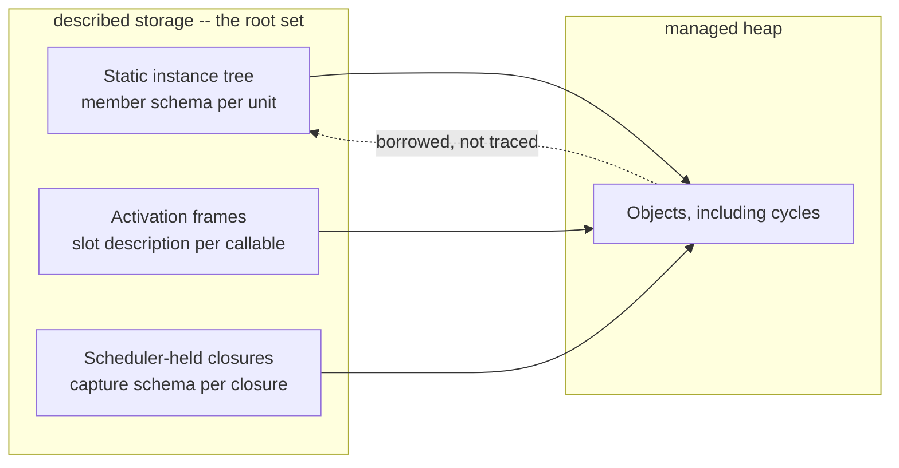

# Managed value realization on the execution backend: a delegated frame holds no root

Date: 2026-09-01 Status: accepted

## Context

A SystemVerilog class handle is a managed reference whose lifetime is reachability, realized by a
precise tracing collector ([object-model](object-model.md) Decision 3). Precision has one structural
requirement: every managed reference that can be live at a safepoint must be enumerable exactly
(`../architecture/object_lifetime.md` invariants 3 and 4).

This entry settles where a managed value lives on the execution backend. It is the question that
gates every other class question there -- dispatch, type-associated storage, and base placement are
all unreachable while an object cannot be constructed at all -- and it is a storage question, so it
belongs beside the entries that settled the other storages this backend has.

Two facts about this backend frame it, and the second decides.

A process is an LLVM coroutine, and [jit-process-suspension](jit-process-suspension.md) D4
**delegates the resumable form** to LLVM's coroutine passes: the emitter states where a body
suspends, and the passes derive the frame layout, the resume state machine, and which values survive
a suspension. That delegation is what keeps the emitter a mechanical translation instead of a
compiler pass, and it is not revisited here.

And collection runs at allocation and at scheduler boundaries, so the state live at a safepoint is
mostly the state of **suspended** executions. The representation of suspended execution is therefore
the load-bearing one, not an edge case.

## The fork that decides it

Making suspended execution enumerable has exactly two shapes, and which one a compiler is in is
decided before any collector question is asked.

Owning it is how the mainstream managed runtimes get precision: a runtime that lays out its own
stacks or its own suspended-state object can describe what it laid out. Delegating it buys a correct
spill computation and gives up the description; LLVM's coroutine documentation states that a
frontend cannot enumerate or control which values are spilled, and does not discuss collector roots
at all.

Lyra delegates. So the conclusion is forced rather than chosen: **a managed value may never be among
the values the coroutine passes spill.**

The shape of that argument matters as much as its conclusion. It does not appeal to this backend's
value realization. Values here are opaque handles into runtime-owned storage
([jit-value-realization](jit-value-realization.md)), which already places most state in describable
storage -- but that is a stated baseline with native in-frame layout as its later path, so an
argument resting on it would be revisited whenever the baseline is. This one is not: laying
non-managed values out natively in the coroutine frame changes nothing here, because the frame is
still someone else's.

## Decision

**A managed value never lives in storage this compiler does not describe. Every managed reference
that can be live at a safepoint lives in one of three described storages, and those descriptions are
the root set.**

### D1. Three described storages, and they are the root set

Each already has, or gains, a compiler-produced description of its slots and their types. Root
enumeration is walking those three descriptions; nothing else is a root, and nothing is discovered
by scanning.

### D2. The activation frame becomes described

Cross-suspension value storage is a set of independently allocated cells in an untyped arena today
([cross-suspension-value-storage](cross-suspension-value-storage.md)), which is sufficient while
only non-managed values live there and insufficient the moment one managed value does. The frame
gains a per-callable description of its slots and their value domains; the activation holds one
frame object built from it, and a load or a store names a slot.

This removes an operation rather than adding one: with the frame built once from its description,
the per-cell allocation the current shape needs has nothing left to do.

The description covers what the managed value forces and no more.
[activation-frame-and-transient-scope](activation-frame-and-transient-scope.md) rejects a general
slot schema built ahead of the consumer that shapes it, and that rejection stands -- a managed value
is that consumer, arriving now.

### D3. The static instance tree is a root set, not a heap resident

A module or generate-scope object holds a managed field wherever a class-typed variable resolves to
static lifetime, which is the module default (LRM 6.21), so the edge from the static tree into the
managed heap exists in the first program that declares a class handle in a module. That edge is a
root edge and nothing more: the collector reads the managed members off the tree and does not
descend into it.

The tree is not moved into the managed heap. It carries an ordered, observable lifecycle -- the
elaboration phases and a teardown -- while a managed heap's contract is that reclamation is
unordered and unobservable with no finalizer (`../architecture/object_lifetime.md` invariant 9). One
object cannot satisfy both.

A design that declares no class contains no managed edge anywhere in its tree, and traceability is a
recursive property of the type, so root enumeration for such a design visits nothing.

### D4. Safepoints are allocation and scheduler boundaries

Both are already runtime calls, so generated code carries no safepoint construct, no poll, and no
root-registration sequence. A managed allocation is reachable from a root before the next safepoint
(`../architecture/object_lifetime.md` invariant 8), which is a property of where the allocation
entry publishes its result, not of an instruction the emitter places.

### D5. Reclamation is staged; the storage discipline is not

The discipline above is whole-system: every site that can hold a managed value must be described, so
each one added without a description is a retrofit later. The collector algorithm reads those
descriptions and touches no generated code, no LIR, and no MIR, so it lands separately.

Until it lands, managed objects are not reclaimed. That is the intermediate state
[object-model](object-model.md) Decision 3 admits during implementation and refuses as a terminal
one; it is not a lifetime model and no consumer reads it as one.

## Invariants

1. No managed reference lives in a coroutine frame, in a machine register across a safepoint, or in
   any storage this compiler has not described.

2. Root enumeration walks the three described storages of D1 and nothing else. No root is discovered
   by scanning memory, and no root is registered by a sequence the emitter places in generated code.

3. An activation frame's slots and their value domains are stated by MIR-to-LIR. The frame is one
   object built from that statement; a slot is named, never separately allocated.

4. The static instance tree is a root into the managed heap, never a resident of it. A managed
   object's reference back into the tree is borrowed and is not traced.

5. Whether a storage participates in tracing follows from the types of its slots, not from a routing
   decision made where the storage is created.

6. A generated module gains no instruction for the collector's sake. Safepoints coincide with
   runtime calls generated code already makes.

## Rejected

- **`gc.statepoint` with stack maps.** The mechanism describes the machine stack at a safepoint in
  running code. The state that matters here is a suspended execution's, which is in the coroutine
  frame rather than on the stack, so this covers the minority case and leaves the majority
  unanswered. It stays available as a later addition bought for speed -- if managed handle traffic
  in running code ever dominates -- and it would supplement the described frame rather than replace
  it.

- **A shadow stack.** The standard answer when locals live on the machine stack, and it is the
  reason Julia and LLVM's own `gcroot` strategy use one. Here the managed values are already in
  described storage, so a shadow stack would be a second place a managed root can live, and two
  places that must agree can disagree. Its per-call-site cost is real and would be paid for nothing.

- **Conservative scanning.** It needs none of this decision: no description, no root enumeration, no
  compiler work. The objection is not imprecision in the abstract -- production languages ship it --
  but what this heap is full of. A conservative collector's false retention is the rate at which
  non-pointer data resembles an address, and a simulator's heap is dominated by four-state vector
  payloads: arbitrary bit patterns, in bulk. Retention would grow with the design rather than with
  the program's garbage, and would be undiagnosable from outside.

- **Moving the static instance tree into the managed heap, so one mechanism serves every object.**
  The uniformity is real and the cost is not only the per-collection mark of a whole design. The
  tree's lifecycle is ordered and observable and the heap's contract is that reclamation is neither;
  the merged system would have to serve both, which is the ordered-finalization requirement every
  managed language has learned to keep out of its collector.

- **A separate traceable-frame path beside the value-cell path, selected by whether a local's type
  is managed.** It is the shape [cross-suspension-value-storage](cross-suspension-value-storage.md)
  left room for, and it makes "where does a local live" have two answers chosen by a predicate. One
  described frame gives the same answer for both, and invariant 7 of
  `../architecture/object_lifetime.md` -- only managed-carrying state participates in tracing --
  then follows from the slot's type instead of from the routing.

## Consequences

- Object construction, member access, and handle semantics become reachable on the execution
  backend, which is what every other class-support question there was waiting on.
- The activation frame stops being the one storage on this backend without a description, closing an
  asymmetry with member storage ([member-slot-storage](member-slot-storage.md)) that was invisible
  while only non-managed values crossed a suspension.
- Every construct that can hold a managed value -- a frame slot, a closure capture, a scheduler
  payload -- owes a description when it is added, and is checkable against that rule rather than
  reviewed for it.
- A design with no classes pays nothing: no root walk, no safepoint work, no collector.
- What this entry does not settle: where a base class's storage sits inside a derived object,
  dispatch realization, and type-associated storage. Each is a separate question that becomes
  reachable once an object can be built.

## Cross-references

- `../architecture/object_lifetime.md` -- the managed-object lifetime contract this realizes:
  reachability, precise tracing, the activation frame as traceable storage, roots, and safepoints.
- `../architecture/object_model.md` -- the managed reference as one kind on the reference axis, and
  the object model a class shares with a module instance.
- [object-model](object-model.md) -- Decision 3, precise tracing over reference counting and an
  arena, and the staging it admits.
- [jit-process-suspension](jit-process-suspension.md) -- the delegation of the resumable form to
  LLVM's coroutine passes, which is the fact this entry derives from.
- [cross-suspension-value-storage](cross-suspension-value-storage.md) -- the activation value cell
  for non-managed values, gated away from managed ones, whose gate this entry replaces with a
  description.
- [activation-frame-and-transient-scope](activation-frame-and-transient-scope.md) -- the naming and
  the escape invariant, and the rejection of a slot schema built ahead of its consumer.
- [member-slot-storage](member-slot-storage.md) -- the described member storage this frame
  description is the counterpart of.
- [jit-value-realization](jit-value-realization.md) -- the opaque-handle baseline, and why this
  decision deliberately does not rest on it.
